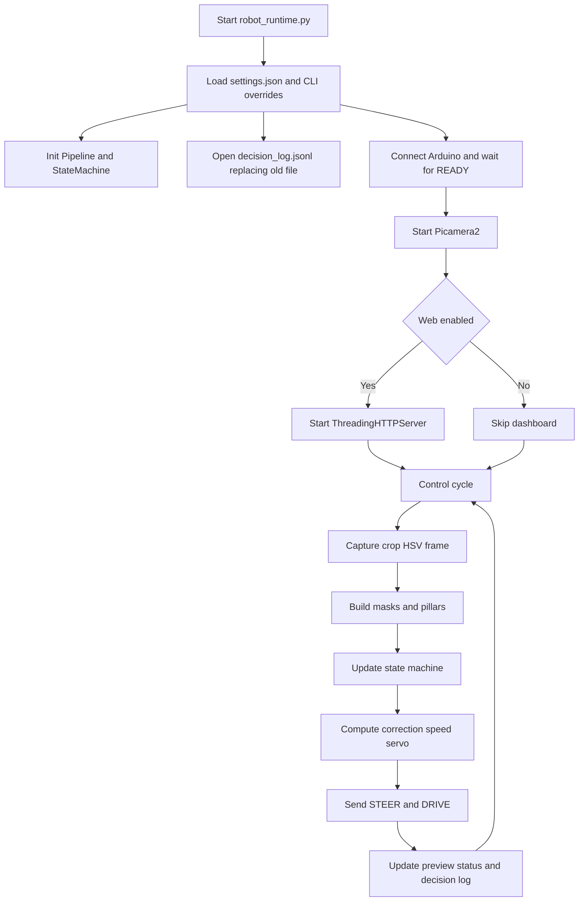
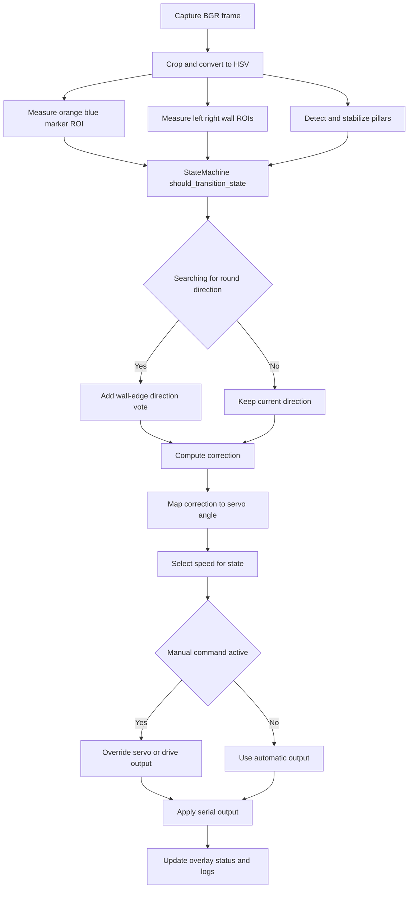
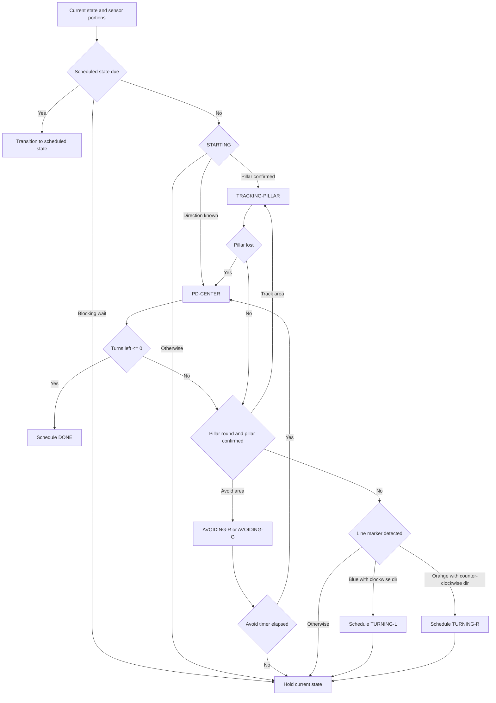
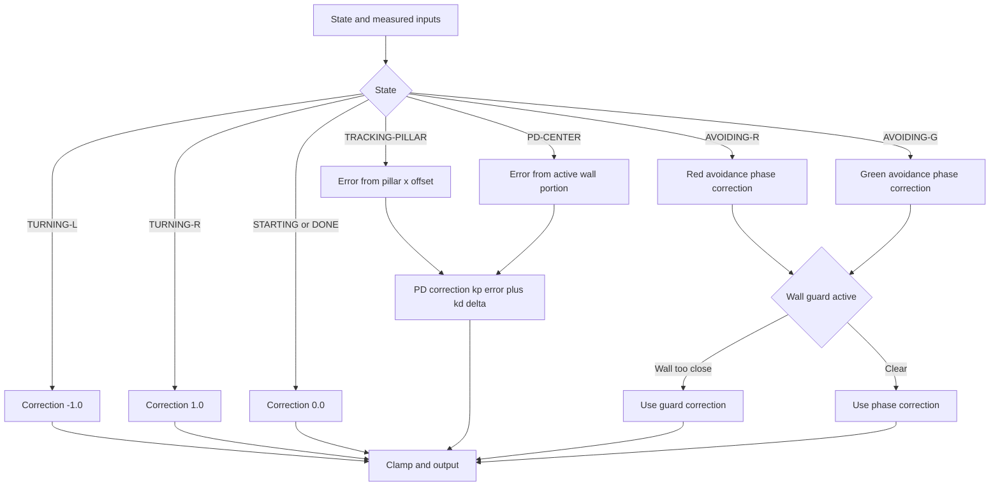
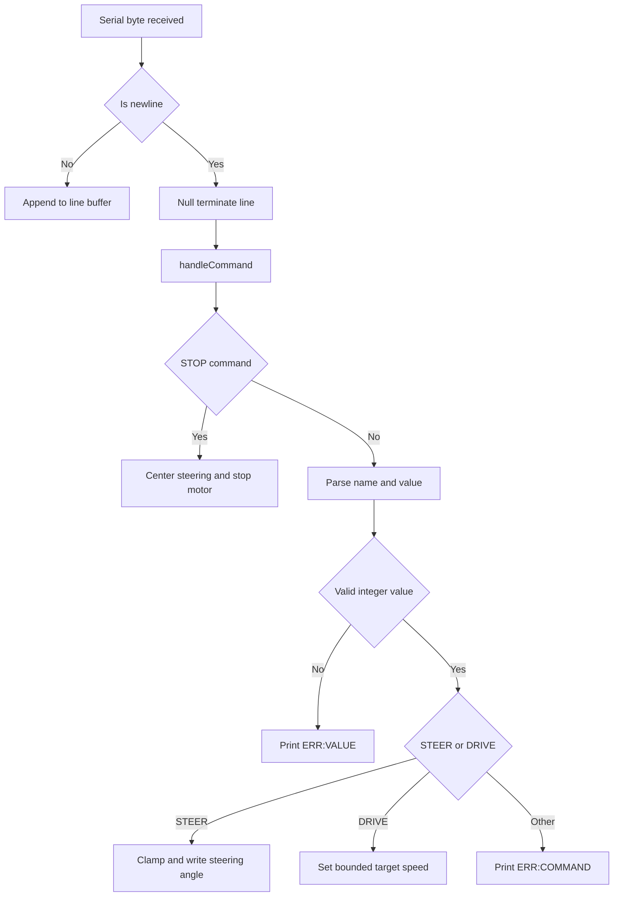
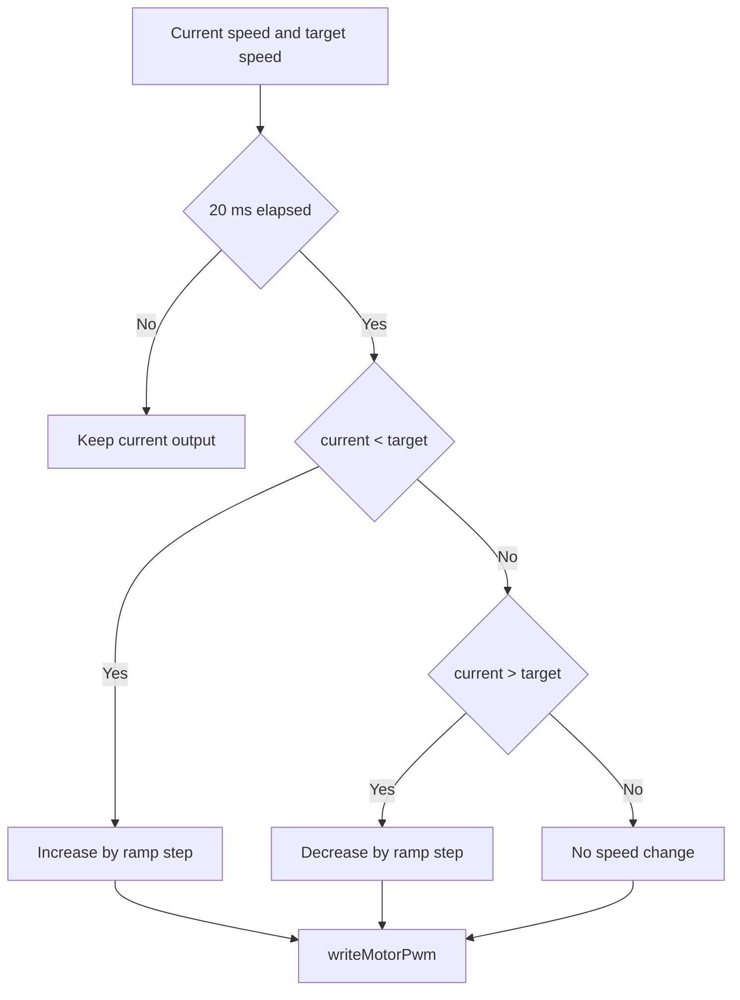
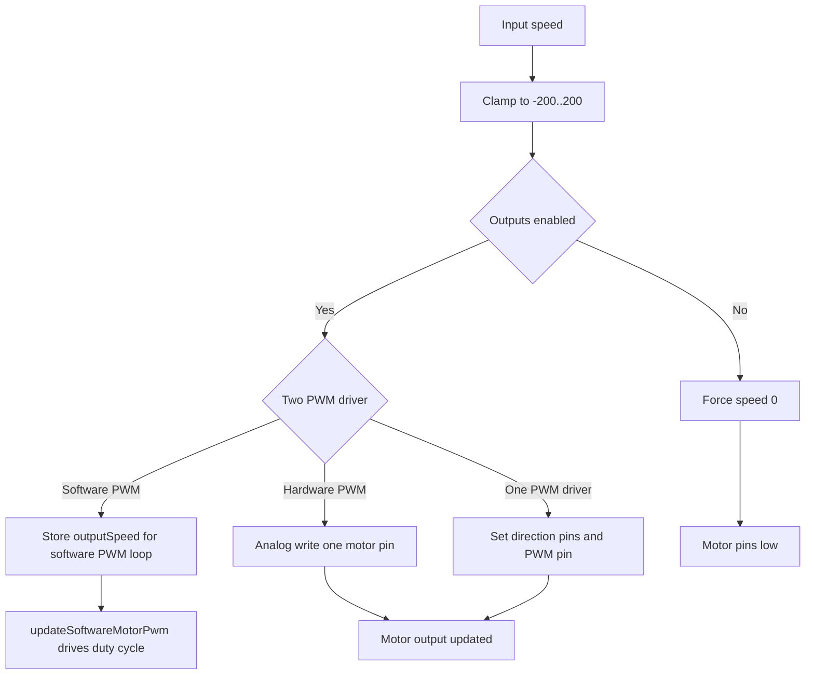
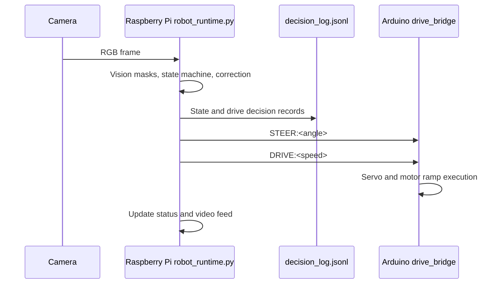

# WRO 2026: Future Engineers - Flame

## Table of Contents 

1. [Overview](#overview) 
2. [Design Process](#Design-Process)
3. [Car Photos](#carphoto)
4. [Mobility Management](#Mobility-Management)
    - [Chassis](#Chassis)
    - [Assembly Instructions](#assembly-instructions) 
    - [Driving Motor and Gearing](#Driving-Motor-and-Gearing)
    - [Steering and Differential Mechanism](#Steering-Mechanism)
    - [Battery](#Power-supply)
    - [Controllers](#Controllers)
    - [Sensors](#Sensors)
    - [Camera](#camera)
    - [Schematics](#schematics) 
    - [Components List](#components-list) 
5. [Software Design](#software) 
    - [Software Development](#software-development)
    - [Code Installation and Run Guide](#code-installation-and-run-guide)
    - [Opening Race](#opening-race)
    - [Obstacle Race](#obstacle-race)
    - [Programming Languages](#programming-languages) 
    - [Dependencies](#dependencies) 
6. [System Thinking and Engineering Decisions](#system-thinking-and-engineering-decisions)
7. [Utilities](#utilities) 
    - [Failsafe Mechanisms](#failsafe)
    - [Debugging Tools](#debugging-tools) 
    - [Web Debug Interface](#web-debug-interface)
8. [Team Photos](#team-photos) 
9. [Demonstration Videos](#demonstration-videos) 
10. [Contributors](#contributors) 
11. [Resources](#sources) 

   

## Overview

Welcome to the official GitHub repository for Flame from Türkiye. This project documents the development of our autonomous vehicle designed to compete in the 2026 World Robot Olympiad (WRO) Future Engineers competition.

Our objective was to develop a high-performance autonomous vehicle capable of navigating complex tracks, avoiding obstacles, and recognizing traffic signals using OpenCV. For the 2026 season, we focused on a dual-controller architecture combining the high-speed image processing of a Raspberry Pi 5 with the real-time reliability of an Arduino Nano R4.

## Design Process

We moved through two major phases to reach our current build:

### Phase 1 (The LEGO Prototype): 

Initially, we built a frame using LEGO components and N20 Micro Gear Motor with an encoder. While excellent for rapid prototyping, the N20 motors lacked the torque required for consistent low-speed movement, and the LEGO frame exhibited structural flex under high-speed turns. Also the placement of our micro servo to the lego chassis proved to be a challenge.

From this phase, we took note of what we need to improve:

- Soldering, instead of WAGO Connectors
    - These WAGO connectors really save time and effort when connecting components, but takes up a lot of unnecessary space. Also, it was nearly impossible to tidy our wires with these connectors attached.
- Chassis flex and play at joints: under acceleration and cornering, small connection tolerances introduced steering drift.
- Limited packaging freedom: fixed LEGO geometry made it hard to place electronics and sensors exactly where we wanted.
- Center-of-mass inconsistency: battery and board placement options were limited, which affected balance between runs.
- Mounting rigidity for non-LEGO parts: integrating the motor, servo, and custom electronics required adapters and workarounds. 

### Phase 2 (The Custom 3D-Printed Build):

To solve the rigidity issues and to completely utilize the space we have, we designed a custom 3D-printed chassis. This allowed for a lower center of gravity and dedicated mounting points for the camera, steering, differential modules and sensors, significantly solving our problems. In short, Prototype 2 directly addressed the Phase 1 pain points: it improved rigidity, enabled cleaner wire/electronics routing, and gave us intentional component placement for better balance and repeatability. The robot is made of 3 parts: chassis, movement modules and electronics. The walls located in the center of the chassis houses the motor, while providing structual rigidity for the sandwich board of electronics mounted at the top. We designed the front and the back according to the measurements of our lego modules, resulting in a good placement. We adress the aspects of these in detail in the following chapters

### Car Photos

Here are our official photos of our car:

For high resolution pictures, please visit: [Car Photos](#carphoto)

### Mobility Management 

### Chassis

For fast prototyping, we first used lego for our chassis. Using a lego technic crane as an example we developed a small car-like chassis. But this wasn't really good for the robot, because of the accuracy and sag problems it has. Also we couldn't really place electronics where we wanted, because of the lack of real customasibility, and we really could not use the space limits we have, the way we wanted. So, we wanted to go with a 3d printed chassis. First we wanted to test the motor and differential placement, and how it holds the weight our robot. This first version was designed to have a steering system that was 3d printed. But since we changed this, we also changed our chassis. We thought we should have a more stable place to our previously made curcuit which is like a 2-layer copper sandwich board. So with these in mind, we extended the motor mounting walls to the side to provide a stable place to mount the electronics, achiveing a good center of mass. These side walls also enabled us to mount the side ultrasonic sensors in Version 2. 

The chassis we inspired from:

Lego Chassis:

First Version - 3D Printed:

Second Version - 3D printed; with more structural stability which includes additional side walls for the electronics and the side ultrasonic sensors:

For more sketches of the chassis please visit the [3d-print files](./3d-print%20files/)

### Tires:

In our tests we compared 3 different tires from 2 different manufacturers. We tested the tires that were included in the spike prime lego set, standard tires from clementoni and onother set from the EV3 set.  Because of their lack of traction, we could not achieve good results with with the blue spike tires. Instead; we used the heavy-duty ev3 lego tires which have much better traction for the rear tires because of them being flexible rubber. Meanwhile, for the steering axle we used hard ones from clementino with grooves. 

### Assembly Instructions

To reproduce our robot, follow the sequence below.

1. **Prepare all files and parts**
   - 3D print all chassis parts from [`3d-print files`](3d-print%20files):
     - `chassis.stl`
     - `servo_adapter.stl`
     - `dc-motor_adapter.stl`
   - Open the wiring design in [`Schematic/wro.fzz`](Schematic/wro.fzz) with the Fritzing desktop app.
   - Download and prepare the LEGO module manuals from [`lego models && instructions`](lego%20models%20%26%26%20instructions):
     - `differential.pdf`
     - `steeringa.pdf`
   - Confirm all electronics and mechanical items from the Components List are available.

2. **Assemble the electronics**
   - Wire every component according to the [Schematics](#schematics) section and `Schematic/wro.fzz`.
   - Mount the control boards, regulators, and wiring on the top sandwich board.
   - Secure parts with screws/zip ties and use silicone supports where required.
   - Keep wiring away from moving drivetrain and steering parts.

3. **Build the LEGO modules**
   - Build the differential module from `differential.pdf`.
   - Build the steering module from `steeringa.pdf`.
   - Verify both modules move smoothly before mounting.

Differential:

Steering:

4. **Final mechanical integration**
   - Mount the JGB37-520 motor to the chassis center wall with M3 screws.
   - Connect the motor to the differential via the printed motor adapter.
   - Mount differential and steering modules on the chassis using silicone supports.
   - Connect the servo horn to the LEGO steering module and check full travel.
   - Install the sandwich board on the upper supports and route all cables cleanly.
   - Connect the battery last and confirm emergency access to the main power switch.

### Driving Motor and Gearing

In our first lego prototype, we used the n20 6v motor. The motor was too small and had really bad torque for our robot. With this motor, the robot moved really slow and did not respond well to low speed requests. It sometimes didn't drive entirely because of the robot wanting to go slow. We didn't want to use a 12v motor first becuase our battery was 7.4 volts. After some research, we thaught that our motor driver the L298N could be the culprit. Becuase of this drivers low efficieny, it couldn't perform well. It also caused some voltage sag. The L298 family dissipates approxiamtely 1.4v as heat, another thing is that the minimum PWM speed control value was rather, not giving us a good range. So we first tried to change the driver to a much more efficent, space saving and advanced component, the DRV8874. We tried it with advanced pwm controls but we couldn't solve it. The last option for us was upgrading the motor to the JGB37-520 which is 12v. We intentionally bought a high rpm version, so we could give it the same 7.4v but it could deliver the same speed we want, while increasing the torque. This was a success. This motor really outperformed the old n20 and delivered great driving to our robot. We used two m3 screws to attach this motor to our chassis, and a lego adapter to connect to motor to the differential module. This way we achieved a 1:1 gear ratio, motor starts at much lower PWM values and the braking distance is much shorter.

Old L298N:

New DRV8874:

Old n20 6V

We switched from the L298N to the DRV8874 before eventually upgrading the motor itself. The DRV8874 is a significant improvement: it is far smaller, has near-zero drop voltage (vs. ~1.4 V on the L298N), and supports efficient PWM control with a much wider effective duty-cycle range at low speeds.

### Steering and Differential Mechanism

We wanted to use steering and differential module that were 3d printed, but after several prints the parts did not hold up and caused anomalies. 

Expected outcome:

Broken guide rail after the first try:

After this experience, we decided to stick with lego for these modules. Lego parts were much more durable due to them being injection molded. Then we designed them and mounted them on the chassis with silicone.

### Battery

We use a 7.4 V-Lithium-polymer battery as our main power supply.
Per our research, we did not want to use a 11.1 V Lipo, as this one is very heavy, compared to the 2-cell version. We wanted to use a high-capacity one, becuase the Raspberry Pi is very Power-hungry when doing image processing. 
The on/off switch is located directly on the top of the robot for ease of access in an emergency. The step down convertor powers all of our sensors and motor at 5v. Also to not put strain on the LM2596, we used a high capacity PD 3.0 compatible voltage regulator board to power the pi. The arduino gets its power by the usb-a to usb-c cable along with serial communication with the pi.

See the schematics for details on connections.
[Schematics](#schematics)

#### Power Budget

To ensure the battery and regulators can handle the full electrical load, we estimated the peak and average current draw for each subsystem:

| Component | Supply Rail | Avg. Current | Peak Current |
|---|---|---|---|
| Raspberry Pi 5 (8GB, image processing) | 5 V (PD 3.0 board) | ~2.0 A | ~3.0 A |
| Arduino Nano R4 | 5 V (via USB-C from Pi) | ~30 mA | ~100 mA |
| JGB37-520 Motor (at 7.4 V) | 7.4 V (direct) | ~0.8 A | ~3.0 A (stall) |
| MG90S Servo | 5 V (LM2596) | ~150 mA | ~600 mA |
| HC-SR04 × 3 Ultrasonic Sensors | 5 V (XL4016) | ~45 mA | ~45 mA |
| MPU6050 IMU | 3.3 V (via Arduino) | ~4 mA | ~4 mA |
| TCS3200 Color Sensor | 5 V (XL4016) | ~2 mA | ~2 mA |
| DRV8874 Motor Driver (quiescent) | 7.4 V | ~1 mA | ~1 mA |

**5 V sensor rail (XL4016):** ~200 mA average — well within the 5 A rated capacity.

**Pi supply (PD 3.0 board):** Up to 3 A peak — we selected a QC 4.0/3.0 compatible module rated for 6–35 V input so it efficiently steps down from 7.4 V without the drop-voltage penalty of a linear regulator.

**Motor rail (7.4 V direct):** Average ~0.8 A, brief stall events up to ~3 A. The DRV8874 is rated for 3.5 A continuous / 5 A peak — adequate margin.

**Battery runtime estimate:** With a 3300 mAh cell and an average total draw of approximately 3.5 A across all rails, the theoretical runtime is ~56 minutes per charge. In practice we rotate between two battery packs between rounds.

We deliberately chose the 2-cell (7.4 V) LiPo over a 3-cell (11.1 V) because the 3-cell variant weighs roughly 30–40 g more for the same capacity and would require an additional high-power step-down stage for the motor. The 2-cell voltage is sufficient for the JGB37-520 at the RPM we need (we purchased the high-RPM variant specifically to offset the lower voltage).

### Controllers

For this season, we used a raspberry pi 5 and an arduino nano r4. We evaluated a single-controller design (Pi only), but kept a **dual-controller architecture** because actuator timing is more stable when low-level hardware control remains on a microcontroller.

#### Why two controllers?

- **Raspberry Pi 5 (high-level controller):**
  - Captures camera frames
  - Runs wall following, lap/section counting, and obstacle logic
  - Hosts the Flask web dashboard for live tuning and telemetry
  - Sends compact drive/steer commands to Arduino at fixed intervals

- **Arduino Nano R4 (real-time actuator controller):**
  - Executes steering servo commands immediately
  - Drives DC motor direction/PWM pins with low and predictable latency
  - Parses serial commands safely and applies bounds before output

This split lets the Pi focus on heavy image processing while Arduino handles deterministic motor/servo control.

#### Communication design (Pi ↔ Arduino)

We tested two serial methods:

1. **GPIO UART (TX/RX pins + level shifter)**  
   Not reliable in our setup because of 3.3 V (Pi) to 5 V (Arduino) level differences and intermittent link failures.

2. **USB serial (Pi USB-A to Arduino USB-C)**  
   This proved stable and simpler to maintain, so it became our final design.

Command flow is one-way for control:
- Pi sends line-based commands such as `STEER:<value>` and `DRIVE:<value>`
- Arduino validates and applies commands to hardware outputs

The link runs at **9600 baud** with a control update cadence around **20 Hz** (`send_interval = 0.05 s`).

#### Startup behavior and reliability

When USB serial is opened, Arduino may reset. To prevent unsafe movement during this phase, we use a startup handshake and safe defaults:

- Arduino starts with motor output in stop/coast state
- Pi waits for serial readiness before normal command streaming
- Control commands are only trusted after parser/connection readiness

This sequence avoids accidental motion during boot and makes power-up behavior repeatable in competition conditions.

### Sensors

Our car is equipped with a total of four sensors, not including the camera. Three of them are ultrasonic sensors, which allow for the detection of nearby obstacles.
In addition our vehicle has an IMU, the MPU6050, which is located in the top center of the robot.
Our IMU helps measure rotational movements, providing more precise control during straight sections and turns.

We have three ultrasonic sensors (hc-sr04) to measure distances to the left, the front and the right. In the opening race, some of the streets can be narrow. To avoid hitting a wall, the sensors detect the robot getting too close.

To run rather reliable turns and to go straight no matter which starting place, we use MPU6050 IMU sensor. 
This sensor has a gyroscope, an accelerometer and a compass onboard, but we only utilize the gyro.
However, gyroscopes tend to drift, when mounted on moving vehicles, that is why we use this data combined with the camera.

#### Sensor Calibration

**Ultrasonic sensors (HC-SR04):** The HC-SR04 outputs a distance in centimeters based on the echo pulse duration. We verified the accuracy by measuring a known distance of 20 cm in a controlled environment and confirming the returned value matched within ±1 cm. No software offset was needed.

**IMU (MPU6050) — gyroscope:** We initialize the IMU at robot startup while the robot is stationary. The first 100 readings are averaged to compute the zero-rate bias for each axis, which is then subtracted from subsequent readings. This removes the static offset and reduces apparent drift during straight driving.

**Camera HSV color thresholds:** The web dashboard (Flask UI) exposes all HSV lower and upper bounds for red, green, orange, and blue in real time. We calibrate under competition lighting by placing a pillar or line marker in the camera view and adjusting bounds using the live MJPEG stream until detection is stable and noise-free across at least 30 consecutive frames. Calibrated values are saved to `config.json`.

### Camera

We wanted to use a high quality camera, which has a wide angle of view and is compatible with OpenCV. The native Raspberry Pi Camera 3 suited all of our needs, on paper. In reality despite it being a wide angle camera, it was not enough for the obstacle round. The objects did not sometimes appear on the camera view, which causes problems. 

To solve this, we added a **0.45x wide-angle 37mm clip-on lens** in front of the Raspberry Pi Camera 3 module. This lens increases the visible area in front of the robot, especially at close range where obstacle pillars were previously leaving the frame. With the wider field of view, near-edge obstacle detection became more reliable and gave the control loop earlier visual input for steering decisions.

### Schematics 

Circuit schematics and hardware layouts are available in the [Schematic folder](Schematic).

### Components List

### 1. Computing & Control

Main Controller: Raspberry Pi 5 (8GB RAM)

Cooling: Raspberry Pi 5 Active Cooler + Aluminum Heatsink Set

Storage: SanDisk Extreme Pro 32GB MicroSD Card

Power Input: USB-C Power Cable with Integrated Switch (Type-C)

Display Interface: Micro HDMI to HDMI Cable (1.5m)

Second Controller: ~~Arduino Uno r3 (clone)~~ (For the drivetrain and sensors) Changed to a arduino nano r4 for latency issues.

### 2. Perception & Sensing

Primary Camera: Raspberry Pi Camera Module 3 (Wide Angle)

Camera Connection: Standard-to-Mini Camera Ribbon Cable (20cm)

Camera Lens: 0.45x 37mm clip-on Lens

Inertial Measurement: MPU6050 6-Axis Accelerometer and Gyroscope Sensor 

Object Detection: HC-SR04 Ultrasonic Distance Sensors (3 units)

Color Detection: TCS3200 Color Recognition Sensor Module

### 3. Propulsion & Drive System

Main Drive Motor: JGB37-520 DC Gear Motor (12V, 1590 RPM)

Secondary/Testing Motor: JGA12-520 DC Gear Motor (6V, 1500 RPM)

Motor Driver: DRV8874 Single Brushed DC Motor Driver Carrier

### 4. Power Management

Battery: 3300mAh 7.4V 2S Li-Po Battery (2 units)

Voltage Regulation (Step-Down): XL4016 High-Power DC-DC Buck Converter (5A)

LM2596 DC-DC Buck Converter (3A)

Voltage Regulation (Step-Up): MT3608 Adjustable DC-DC Boost Converter (2 units)

Specialty Power: USB-C QC4.0/QC3.0 Fast Charging Module (6V-35V Input)

### 5. Wiring & Connectivity

Connectors: XT60 Male Connection Cables (12AWG)

XT60 to Banana Plug Adapter Cable

DC Barrel Jack with Terminal Block

Wiring: 14 AWG High-Flex Silicone Wire (Red and Black)

~~Rapid Wire Connection Kit (55 pieces)~~ We decided to ditch this in favor of soldering. These WAGO connectors really save time and effort when connecting components, but takes up a lot of space. Also, it was nearly impossible to tidy our wires with these connectores attached.

Management: Cable Tie/Zip Tie Set

### 6. Mechanical Hardware

Fasteners: Assorted Screw and Nut Set (200 pieces)

M2 Screws and Nuts (8mm)

M4 Screws (6mm & 12mm), Washers, and Nuts

### 7. 3D-Printed Parts

Our robot has a total of 3 pieces which are 3d printed. Theses are:

the chassis, 

MG90s servo to lego adapter

and our JGB37-520 motor to lego adapter. 
Developing these parts took a lot of trial and error mainly because of tolerances. The printed parts did not expecatations, mainly because of durability reasons, but we have fixed this by increasing the infill rate of our adapters. This way we could combine the high-quality and durable lego parts with our motors.

  
  
# Software  
  
  
  
## Software Development  
  
The software is split into two controllers that cooperate during every driving cycle:  
  
1. **Raspberry Pi 5 (`raspy/robot_runtime.py`, Python)**  
   - Captures frames from the Raspberry Pi camera with `picamera2`  
   - Uses OpenCV/NumPy to crop the camera view, detect wall masks, floor markers, and red/green pillars  
   - Runs the driving state machine and computes steering/speed decisions  
   - Hosts the live preview, configuration, calibration, status, and manual-test web interface  
   - Writes decision records to one JSONL log file for review after a run  
   - Sends compact serial commands to the actuator controller  
2. **Arduino Nano (`arduino_outputProxy/drive_bridge/src/main.cpp`, C++ / Arduino framework)**  
   - Receives `STEER`, `DRIVE`, and `STOP` commands over USB serial  
   - Drives the steering servo with bounded absolute angles  
   - Drives the DC motor through the configured H-bridge pins with ramp limiting and timeout stop  
   - Keeps low-level actuator timing separate from Linux scheduling on the Pi  
  
The Pi makes the navigation decisions; the Arduino executes low-latency hardware actions. The WRO 2026 rules require the vehicle to drive autonomously, follow the randomly chosen round direction, complete three laps, and in the obstacle challenge pass red pillars on the right and green pillars on the left. The software is organized around those decisions.  
  
### Libraries Used in Runtime Files  
  
#### `arduino_outputProxy/drive_bridge/src/main.cpp` (Arduino/C++)  
- `Arduino.h`  
- `Servo.h`  
  
#### `raspy/robot_runtime.py` and modules (Python)  
- Standard library: `argparse`, `glob`, `json`, `os`, `threading`, `time`, `http.server`  
- Third-party: `cv2` (OpenCV), `numpy`  
- Optional/hardware-specific: `serial` (pyserial), `picamera2`  
  
  
  
### Programming Languages  
  
| Controller | Language | IDE / Toolchain |  
|---|---|---|  
| Raspberry Pi 5 | Python 3 | Visual Studio Code / terminal |  
| Arduino Nano | C++ (Arduino framework) | PlatformIO / Arduino toolchain |  
  
We chose **Python** for the Pi because OpenCV and Picamera2 make camera-based tuning fast. **C++** on the Arduino is used for bounded, deterministic servo and motor output.  
  
  
  
### Dependencies  
  
**Raspberry Pi (Python):**  
  
| Package | Version / Notes | Purpose |  
|---|---|---|  
| `opencv-python` (`cv2`) | 4.x | Color masks, contours, preview overlay, JPEG encoding |  
| `numpy` | 1.x | Array operations for frame processing |  
| `pyserial` | 3.x | USB serial communication with Arduino |  
| `picamera2` | Raspberry Pi OS package | Raspberry Pi camera capture |  
  
**Arduino Nano (C++):**  
  
| Library | Source | Purpose |  
|---|---|---|  
| `Servo.h` | `arduino-libraries/Servo@^1.2.2` | Steering servo PWM control |  
| `Arduino.h` | Arduino framework | Core hardware access, serial, GPIO, timers |  
  
**Build and service tools:**  
  
| Tool | Purpose |  
|---|---|  
| `platformio` | Build and upload the Arduino firmware |  
| `systemctl` | Install, enable, start, stop, and inspect the Pi runtime service |  
  
### Repository Layout  
  
| Path | Purpose |  
|---|---|  
| `main.py` | Root launcher that adds `raspy/` to `sys.path` and calls `robot_runtime.main` |  
| `raspy/robot_runtime.py` | Main Pi runtime, camera loop, serial link, CLI, and `RobotRunner` |  
| `raspy/vision_pipeline.py` | HSV masks, wall mask extraction, pillar contour detection |  
| `raspy/vision_types.py` | Shared `Pillar` data object and ROI helper |  
| `raspy/drive_state.py` | State machine for starting, centering, turning, tracking pillars, avoiding pillars, and done state |  
| `raspy/lap_direction.py` | Black-wall edge voting used to infer clockwise/counter-clockwise direction |  
| `raspy/settings.py` / `raspy/settings.json` | Default settings and tuned runtime configuration |  
| `raspy/control_panel.py` | Built-in HTTP control/configuration dashboard and MJPEG preview |  
| `raspy/decision_log.py` | Central JSONL decision logger, replaced on each run |  
| `raspy/install_vehicle_service.sh` | Installs the systemd service file on the Raspberry Pi |  
| `raspy/vehicle-runtime.service` | systemd unit for starting `robot_runtime.py --pillars` on boot |  
| `arduino_outputProxy/drive_bridge/src/main.cpp` | Arduino firmware for serial parsing and actuator output |  
| `arduino_outputProxy/drive_bridge/platformio.ini` | PlatformIO firmware project configuration |  
  
### Code Installation and Run Guide  
  
Use this sequence on a Raspberry Pi 5 + Arduino Nano setup.  
  
1. **Flash the Arduino controller**  
   - Install PlatformIO if `platformio` is not already available.  
   - From repository root:  
     - `cd arduino_outputProxy/drive_bridge`  
     - `platformio run --target upload`  
   - The checked-in PlatformIO environment and board are both `nanoatmega328new`.  
   - Serial monitor speed is `9600`. On startup the Arduino prints `READY`.  
  
2. **Prepare Python runtime on Raspberry Pi**  
   - From repository root:  
     - `python3 -m venv .venv`  
     - `source .venv/bin/activate`  
     - `pip install --upgrade pip`  
     - `pip install opencv-python numpy pyserial`  
   - Install `picamera2` from the Raspberry Pi OS packages if it is not already present.  
   - `robot_runtime.py` imports `cv2` during startup, so even `--print-config` requires OpenCV to be installed.  
  
3. **Connect hardware**  
   - Connect Arduino to Raspberry Pi over USB.  
   - Confirm Arduino appears as `/dev/ttyACM0` or `/dev/ttyUSB0`; auto-detect is enabled in `raspy/settings.json`.  
   - Connect and enable the Raspberry Pi camera.  
  
4. **Run the robot software**  
   - From repository root:  
     - `python3 main.py --pillars`  
   - Or run the runtime module directly:  
     - `cd raspy`  
     - `python3 robot_runtime.py --pillars`  
   - For a camera run without Arduino output:  
     - `python3 robot_runtime.py --no-serial --max-frames 20`  
   - `--no-serial` disables USB command output only; it still needs OpenCV, Picamera2, and an enabled camera.  
   - The web dashboard is served at `http://<raspberry-pi-ip>:5000/`.  
  
5. **Useful runtime options**  
   - `--config PATH` loads a different settings file  
   - `--set path=value` overrides one setting, for example `--set control.speed=120`  
   - `--save-config` writes overrides back to the settings file  
   - `--print-config` prints the effective configuration and exits  
   - `--fixed-dir -1|0|1` sets clockwise, auto, or counter-clockwise direction behavior  
   - `--web` / `--no-web` enables or disables the dashboard  
  
6. **Before track runs**  
   - Verify steering direction, motor direction, and serial port.  
   - Open `/video_feed` or the dashboard preview and confirm wall, marker, and pillar overlays.  
   - Use Color Sampling in the dashboard to tune HSV thresholds, then save with **Save Config**.  
   - Check `raspy/decision_log.jsonl` after a run to review state changes and drive decisions.  
  
7. **Optional systemd startup service**  
   - The service assumes the deployed project is at `/home/pi/program`, so the runtime path is `/home/pi/program/raspy/robot_runtime.py`.  
   - Copy or sync this repository to `/home/pi/program` before installing the service, or update `raspy/vehicle-runtime.service` to match the deployment path.  
   - Install the service from the repository checkout on the Pi:  
     - `raspy/install_vehicle_service.sh`  
   - Manage it with systemd:  
     - `sudo systemctl start vehicle-runtime.service`  
     - `sudo systemctl stop vehicle-runtime.service`  
     - `sudo systemctl enable vehicle-runtime.service`  
     - `sudo systemctl status vehicle-runtime.service`  
     - `journalctl -u vehicle-runtime.service -f`  
   - The service runs `python3 /home/pi/program/raspy/robot_runtime.py --pillars` with working directory `/home/pi/program/raspy`.  
  

  
---  
  
  
  
## Open Challenge  
  
The WRO 2026 Open Challenge has no traffic signs. The vehicle must drive in the randomly selected direction, complete three laps, and stop autonomously according to the round-end rules.  
  
### Strategy  
  
The implemented strategy is camera-based wall following with color-marker turn detection:  
  
1. **Frame preparation:** `PiCamera.capture_bgr` captures an RGB frame, converts it to BGR, rotates it 180 degrees when configured, and `Pipeline.crop` removes the top part of the image using `camera.crop_height`.  
  
2. **Wall detection:** `Pipeline.filter_RG_Bl` builds a dark wall mask from grayscale intensity and low HSV saturation. It excludes detected red, green, orange, blue, and pink areas so colored markers do not become wall pixels.  
  
3. **Line marker detection:** `Pipeline.filter_OB` builds orange and blue masks inside the configured `roi.line` rectangle. The state machine uses the orange/blue portions to schedule left/right turning states.  
  
4. **Round direction:** If `behavior.fixed_round_dir` is `0`, `lap_direction.find_round_dir` votes on wall-edge geometry until `behavior.round_dir_vote_threshold` is reached. A non-zero fixed direction skips the search.  
  
5. **PD steering:** In `PD-CENTER`, the controller compares the active wall portion against `pd.target_black_portion`. `pd.kp` and `pd.kd` convert the current error and previous error into a correction value.  
  
6. **State machine:** `drive_state.StateMachine` moves through `STARTING`, `PD-CENTER`, scheduled `TURNING-L` / `TURNING-R`, and finally `DONE`. When `turns_left` reaches zero, `DONE` is scheduled after `behavior.finish_delay_seconds`.  
  
7. **Output mapping:** The correction is clamped by `control.max_correction`, converted into a servo offset with `control.max_steering_offset`, bounded to `servo_min_deg..servo_max_deg`, and sent with the selected drive speed.  
  
### Turn Count and Stop Behavior  
  
The code stops through the state machine, not through a separate lap tracker. `StateMachine` initializes `turns_left` from `behavior.turns`, subtracts one when a valid direction-specific orange or blue marker schedules a turn, then schedules `DONE` once `turns_left <= 0`. In `DONE`, `RobotRunner` centers steering and sends zero drive speed.  
  
`settings.DEFAULT_CONFIG` uses `behavior.turns = 12`, which matches three laps on a four-section track. The checked-in tuned file `raspy/settings.json` currently uses `behavior.turns = 120`. The file does not label why this value is used, so it should be treated as the current tuned/test configuration, not the WRO three-lap stop value. For an official three-lap run, set `behavior.turns` to `12` or pass `--set behavior.turns=12`.  
  
---  
  
  
  
## Obstacle Challenge  
  
The WRO 2026 Obstacle Challenge adds red and green pillars as traffic signs. The rules require the robot to pass a red pillar on the right and a green pillar on the left.  
  
### Strategy  
  
1. **Base navigation:** The obstacle run uses the same wall mask, line-marker logic, direction voting, and PD centering as the Open Challenge.  
  
2. **Pillar detection:** `Pipeline.get_pillars` finds red and green contours after median blur and morphological cleanup. Small, narrow, short, or low-fill contours are discarded using the `contours` settings.  
  
3. **Pillar stabilization:** `RobotRunner.stabilize_pillars` keeps one closest pillar track, smooths its area with an EMA, requires confirm frames, and can hold a recently lost pillar for a few frames.  
  
4. **Ignore check:** A pillar can be ignored when orange or blue marker pixels are found inside the narrow pillar ROI. This avoids treating track markers as traffic pillars.  
  
5. **Tracking and avoiding:** In pillar rounds, a confirmed pillar can move the state machine from `PD-CENTER` to `TRACKING-PILLAR`. A larger confirmed pillar changes the state to `AVOIDING-R` for red or `AVOIDING-G` for green.  
  
6. **Avoidance correction:** Avoidance uses a first phase and second phase correction (`pillar_red_first_correction`, `pillar_red_second_correction`, `pillar_green_first_correction`, `pillar_green_second_correction`). The wall guard can override this if one wall portion becomes too high.  
  
7. **Return to center:** After `behavior.pillar_avoid_seconds`, the state machine returns to `PD-CENTER` and enforces a cooldown before another avoid decision.  
  
  
---  
  
## Raspberry Pi Software (`raspy/robot_runtime.py`) — Process Sections  
  
### Section A — Boot and initialization  
  
- Load persisted configuration from `raspy/settings.json`  
- Merge missing keys from `settings.DEFAULT_CONFIG`  
- Apply CLI overrides such as `--pillars`, `--fixed-dir`, `--set`, and web options  
- Initialize `Pipeline`, `StateMachine`, `ArduinoLink`, `PiCamera`, and `DecisionLogger`  
- Start Arduino serial, camera capture, and the optional web server  
  
`settings.ConfigLoader` also accepts a few older configuration keys (`ArduinoSerialPort`, `PD`, and `ROI`) and maps them into the current nested settings structure. New changes should use the current keys shown in `raspy/settings.json`.  
  
### Section B — Frame acquisition and preprocessing  
  
Per frame, the Pi does the following:  
  
1. Capture a frame from Picamera2  
2. Convert RGB to BGR  
3. Rotate 180 degrees when `camera.flip_180 = true`  
4. Crop using `camera.crop_height`  
5. Convert the cropped image to HSV for color masks  
  
### Section C — Vision section  
  
`vision_pipeline.Pipeline` produces the lightweight inputs used by the state machine:  
  
- Orange and blue marker portions from `roi.line`  
- Left and right wall portions from `roi.left_wall` and `roi.right_wall`  
- Red and green pillar candidates from contour area, width, height, and fill ratio  
- Optional pink parking mask helper (`filter_parking`)  
  
### Section D — State and decision section  
  
`drive_state.StateMachine` owns the high-level driving state:  
  
- `STARTING` waits for a direction or confirmed pillar condition  
- `PD-CENTER` performs normal wall following  
- `TRACKING-PILLAR` steers based on pillar x-position  
- `AVOIDING-R` and `AVOIDING-G` use timed avoidance corrections  
- `TURNING-L` and `TURNING-R` apply full correction for corner turns  
- `DONE` forces speed to zero  
  
Important behavior settings include:  
  
- `line_marker_min_portion` for orange/blue marker detection  
- `turn_delay_seconds`, `pillar_turn_delay_seconds`, and `turn_timeout_seconds` for turns  
- `pillar_track_area`, `pillar_avoid_area`, and confirm-frame settings for obstacle behavior  
- `pillar_wall_guard_threshold` and `pillar_wall_guard_correction` for wall protection during avoidance  
  
### Section E — Serial command output  
  
`ArduinoLink` sends line-oriented actuator commands:  
  
- `STEER:<int>`  
- `DRIVE:<int>`  
- `STOP`  
  
The port is auto-detected from `/dev/ttyACM*`, `/dev/ttyUSB*`, or pyserial port listing unless auto-detect is disabled. Commands are paced by `send_interval_seconds` and repeated only after `keepalive_interval_seconds` when unchanged.  
  
### Section F — Web dashboard/API section  
  
The dashboard is served by Python's built-in `ThreadingHTTPServer`:  
  
- `GET /` dashboard  
- `GET /api/status` runtime telemetry  
- `GET /api/config` active config snapshot  
- `GET /video_feed` MJPEG stream  
- `POST /api/config` update one setting path  
- `POST /api/save` persist settings  
- `POST /api/command` manual `STEER`, `DRIVE`, or `STOP`  
- `POST /api/sample`, `/api/apply_sample`, `/api/apply_samples` for color calibration  
  
### Section G — Decision logging  
  
`decision_log.DecisionLogger` writes newline-delimited JSON to one file. By default this is `raspy/decision_log.jsonl`. The file is opened with write mode on startup, so each run replaces the previous decision log instead of creating timestamped logs.  
  
Logged events include:  
  
- `session_start` and `session_stop`  
- `runtime_start` and `runtime_error`  
- `round_direction_selected`  
- `state_update`  
- sampled `drive_output` decisions  
- `config_update` and `manual_command`  
  
Each record stores lightweight inputs, the selected decision/action, and already-computed reasoning values such as wall portions, marker portions, pillar snapshot, correction, PD error, previous error, gain values, vote totals, and manual override status. Raw frames are not written to the decision log.  
  
Console status output is separate from the decision log and is controlled by `debug.log_every_seconds`. Optional frame saving is controlled by `debug.save_frames`, `debug.frame_dir`, and `debug.frame_every_seconds`; when enabled, the runtime overwrites `latest.jpg` in the configured debug frame directory instead of storing a full video history.  
  
The sections above describe responsibilities by module.  
The next flowcharts switch perspective from static sections to **runtime execution order**. These show the steps involved from startup to each control decision.  
  
### Raspberry Pi High-Level Flow  
  

  
### `RobotRunner.cycle` Detailed Flow  
  

  
### `StateMachine.should_transition_state` Flow  
  

  
### `compute_correction` Flow  
  

  
---  
  
## Arduino Software (`arduino_outputProxy/drive_bridge/src/main.cpp`) — Process Sections  
  
### Section 1 — Hardware constants and limits  
  
- `SERVO_PIN = 6`  
- `MOTOR_IN1_PIN = 10`  
- `MOTOR_IN2_PIN = 9`  
- Optional `MOTOR_PWM_PIN = 11` for one-PWM/two-direction wiring  
- Current motor mode: `USE_TWO_PWM_MOTOR_DRIVER = true` and `USE_SOFTWARE_PWM_FOR_TWO_PWM_DRIVER = true`  
- Physical enable input is currently disabled: `USE_ENABLE_PIN = false`, with `ENABLE_PIN = 7` reserved if enabled later  
- Steering bounds: `SERVO_MIN_DEG = 15`, `SERVO_CENTER_DEG = 90`, `SERVO_MAX_DEG = 165`  
- Motor output bound: `MOTOR_MAX_PWM = 200`  
- Ramp settings: `MOTOR_RAMP_INTERVAL_MS = 20`, `MOTOR_RAMP_STEP = 2`  
- Command timeout: `COMMAND_TIMEOUT_MS = 1000`  
- Command line buffer size: `LINE_BUF_SIZE = 64`  
  
### Section 2 — Setup phase  
  
`setup()` performs deterministic startup:  
  
- Configure motor pins and optional enable pin  
- Attach and center steering servo  
- Stop motor output  
- Start serial at `9600`  
- Emit `READY` after startup delay  
  
### Section 3 — Command receive and parse phase  
  
`loop()` and `handleCommand` implement a strict parser:  
  
1. Read bytes until newline  
2. Null-terminate the line buffer  
3. Split `NAME:VALUE` at the colon  
4. Parse the integer payload with `parseIntStrict`  
5. Execute only supported commands  
  
Supported commands:  
  
- `STOP`  
- `STEER:<int>`  
- `DRIVE:<int>`  
  
### Section 4 — Actuator execution phase  
  
- `writeSteering` clamps absolute servo angle to `15..165`  
- `writeMotorPwm` clamps speed to `-200..200`  
- `updateMotorRamp` moves `currentSpeed` toward `targetSpeed` in small steps  
- If no valid command arrives for `1000 ms`, target speed returns to zero  
- If `USE_ENABLE_PIN` is enabled and the input is not active, motor target speed is forced to zero  
  
### Arduino Command Processing Flow  
  

  
### `updateMotorRamp` Flow  
  

  
### `writeMotorPwm` Flow  
  

  
---  
  
## Raspberry Pi ↔ Arduino Runtime Interaction  
  

  
1. The camera streams frames into Pi-side perception/control code.  
2. Pi converts each frame into steering angle and drive speed decisions.  
3. Those decisions are logged as lightweight JSONL records and sent to Arduino over USB serial at `9600` baud.  
4. Arduino parses complete command lines, validates payloads, and updates actuator outputs.  
5. In parallel, Pi publishes status, configuration, calibration controls, and MJPEG video for operators.  
  
---  
  
## System Thinking and Engineering Decisions  
  
This section documents the key software constraints, tradeoffs, and risks that shaped the current implementation.  
  
### Constraints  
  
| Constraint | Value / Limit | Impact |  
|---|---|---|  
| WRO 2026 start procedure | Robot is switched on, waits, then starts after one start action | Current runtime starts immediately after launch; physical start-button wait is not implemented yet |  
| Round direction | Randomly chosen before each challenge round | Direction can be fixed with CLI/config or inferred by wall-edge voting |  
| Challenge length | Open and Obstacle rounds are three minutes | Runtime keeps decisions lightweight and avoids storing raw frames by default |  
| Obstacle rule | Red on right, green on left | State machine has color-specific avoid states and correction values |  
| Actuator timing | Linux is not deterministic for PWM | Arduino owns servo and motor output |  
| Tuning under venue lighting | HSV thresholds move with lighting | Web sampling updates color ranges without reflashing firmware |  
  
### Tradeoffs and Decisions  
  
#### Pi-only control vs. Pi + Arduino split  
The Pi has enough processing power for camera vision, but Linux timing is not the right place to generate direct motor/servo output. We keep perception and planning on the Pi and move low-level actuator execution to Arduino over a small serial protocol.  
  
#### Fixed direction vs. automatic direction voting  
The challenge direction is known before each round, so `--fixed-dir` can be used when we want deterministic setup. The automatic mode remains useful for testing because `lap_direction.find_round_dir` can vote from wall-edge geometry until the configured threshold is reached.  
  
#### Raw-data logging vs. decision logging  
The system logs decisions instead of full camera frames. This keeps one readable `decision_log.jsonl` per run with the inputs and reasoning values needed to debug state transitions, without filling storage with video data.  
  
#### Dashboard framework choice  
The dashboard uses `ThreadingHTTPServer` instead of Flask. The UI is a single embedded HTML page with JSON endpoints, which keeps the runtime dependency set small on the Raspberry Pi.  
  
### Risk Identification and Mitigation  
  
| Risk | Likelihood | Mitigation |  
|---|---|---|  
| Serial port changes between boots | Medium | Auto-detect `/dev/ttyACM*`, `/dev/ttyUSB*`, then pyserial port listing |  
| Arduino receives stale commands | Medium | Firmware forces target speed to zero after `COMMAND_TIMEOUT_MS` |  
| Pillar detection flickers | Medium | EMA area smoothing, confirm frames, and lost-frame hold |  
| Colored floor markers pollute wall mask | Medium | Wall mask excludes detected red, green, orange, blue, and pink pixels |  
| Venue lighting changes HSV thresholds | High | Browser-based color sampling updates filter ranges and saves settings |  
| Decision behavior is hard to review after a run | Medium | Central JSONL decision log records state changes and sampled drive outputs |  
  
### Tests && Decisions  
  
To make the current software decisions reproducible, we keep the values that most affect behavior in `raspy/settings.json`:  
  
| Decision area | Setting / file | Current value or behavior | Reason |  
|---|---|---|---|  
| Camera crop | `camera.crop_height` | `190` | Process only the lower track area used for driving |  
| Drive speeds | `control.speed`, `turn_speed`, `avoid_speed` | `160`, `155`, `115` | Slow down during obstacle handling while keeping normal pace higher |  
| Steering bounds | `servo_min_deg`, `servo_center_deg`, `servo_max_deg` | `15`, `90`, `165` | Protect steering hardware and keep command mapping predictable |  
| Direction behavior | `behavior.fixed_round_dir` | `0` | Use automatic direction search unless set for a round |  
| Marker threshold | `line_marker_min_portion` | `0.25` | Require a clear orange/blue marker signal before turn scheduling |  
| Pillar avoid trigger | `pillar_avoid_area` | `2800` | Avoid only when the pillar is close and confirmed |  
| Decision logging | `decision_log.path` | `decision_log.jsonl` | Replace one log file per run for simple review |  
  
  
---  
  
  
   
   
## Utilities  
   
   
  
   
   
### Failsafe Mechanisms  
   
We implemented multiple layers of failsafe protection to prevent hardware damage and ensure safe competition runs.  
   
#### Hardware Failsafes  
   
**Wire color-coding:**  
We wrapped wires with colored tape so that every wire belonging to the same subsystem shares the same color. This reduces reconnection errors when disassembling and reassembling the robot between rounds. During early testing, an unlabeled wire became detached and was difficult to trace; after introducing color coding, this type of error has not recurred.  
   
**Low-voltage indicator:**  
The LM2596 step-down module (5 V sensor rail) has an onboard LED that dims when input voltage falls below ~7.5 V. This gives us a visual warning that the LiPo cell is approaching its minimum safe voltage before the servo response degrades. We also keep a spare charged battery pack ready so we can swap within the pit stop window.  
   
**Servo mechanical limits:**  
The steering servo is constrained in firmware to an absolute range of 15°–165°. This prevents a software error from issuing a command that would physically damage the servo linkage or lego steering module.  
   
**Motor driver protection:**  
The DRV8874 provides overcurrent shutdown and thermal protection. If the motor stalls or the robot jams against a wall, the driver enters protection mode rather than burning the motor or wiring.  
   
#### Software Failsafes  
   
**Done-state stop:**  
When the state machine reaches `DONE`, the Pi centers the steering and sends zero drive speed. This keeps the vehicle from continuing after the configured turn count is complete.  
   
**Arduino speed ramp limiter:**  
The Arduino changes motor output by `MOTOR_RAMP_STEP = 2` every `MOTOR_RAMP_INTERVAL_MS = 20`. This prevents sudden torque spikes that could cause the chassis to lose traction or cause the motor adapter to slip.  
   
**Serial command validation:**  
The Arduino parser only executes commands that match the expected format (`NAME:VALUE` with a valid integer). Malformed or truncated packets are silently discarded, so a noise burst on the USB serial link cannot cause unsafe motor or servo movement.  
   
**Serial startup handshake:**  
On power-on the Raspberry Pi always resets the Arduino when it opens the serial port. We solved this with a software handshake: the Arduino emits a ready signal after startup, and the Pi waits for that signal before sending any drive commands. This prevents the robot from moving before the Pi has initialized the camera and loaded configuration.  
   
**Command timeout stop:**  
If the Arduino does not receive a valid command for `COMMAND_TIMEOUT_MS = 1000`, it forces target speed to zero. This prevents stale Pi commands from keeping the motor active after a runtime interruption.  
   
  
   
   
### Debugging Tools  
   
**Python (Raspberry Pi):** We use **Visual Studio Code** with the Pylance extension for development. The live web dashboard (`/` and `/video_feed`) allows us to observe the robot's perception state, adjust color thresholds, and test commands in real time without stopping the run. The MJPEG video feed (`/video_feed`) streams the annotated debug overlay directly from `raspy/robot_runtime.py` so we can diagnose wall detection or pillar detection issues without an HDMI cable.  
   
**Arduino (C++):** We use the Arduino toolchain through PlatformIO, plus a serial monitor at `9600`, to inspect incoming command strings and verify that the Pi is sending correctly formatted `STEER` and `DRIVE` packets. During hardware bring-up we also used the serial monitor to verify servo and motor responses independently of the Pi.  
   
  
   
#### Web Debug Interface  
   
Below are screenshots of our real-time debug dashboard used during testing and competition preparation:  
   
  
   
  
   
What this interface is used for:  
   
- **Live monitoring:** We watch the MJPEG stream (`/video_feed`) with overlays to confirm wall and pillar detection quality in real time.  
- **Fast calibration:** We tune HSV bounds and camera/control parameters from the browser, then persist them with `/api/save`.  
- **Runtime diagnostics:** We inspect `/api/status` and `/api/config` output to verify state, direction, active thresholds, and serial settings before each run.  
- **Safe iteration loop:** Instead of reflashing firmware for each small adjustment, we tune through the web UI, test immediately on track, and only commit stable parameter sets.  
   
   
  
   
   
## Team Photos  
   
[Team Photo](https://github.com/user-attachments/assets/fc466126-dbe5-4d71-9a1d-e72979701b23)  
   
  
   
   
## Demonstration Videos  
   
- [Open Round](https://youtu.be/vSCUsRolfGY)   
- [Obstacle Round](https://youtu.be/aSWpX4NWNCk)  
   
   
   
   
  
   
   
## Contributors 👥  
   
- berkemutluu  
- ardaberkk  
   
[Team Photo](https://github.com/user-attachments/assets/fc466126-dbe5-4d71-9a1d-e72979701b23)  
   
  
   
   
## Resources  
- 3D Parts Development [Onshape](https://onshape.com/)  
- Ackerman Steering Mechanism [Wikipedia](https://en.wikipedia.org/wiki/Ackermann_steering_geometry)  
- [Help with Open CV](https://learnopencv.com/)  
- Lego Modules && Instruction Modules Creation [Bricklink Studio](https://www.bricklink.com/v3/studio/download.page)  
   
[Back to top](#top)  

