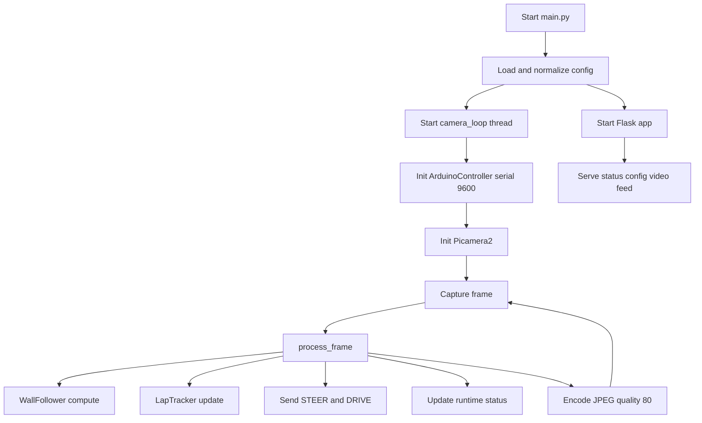
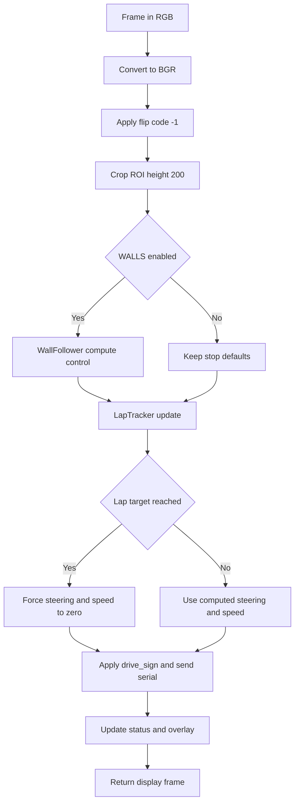
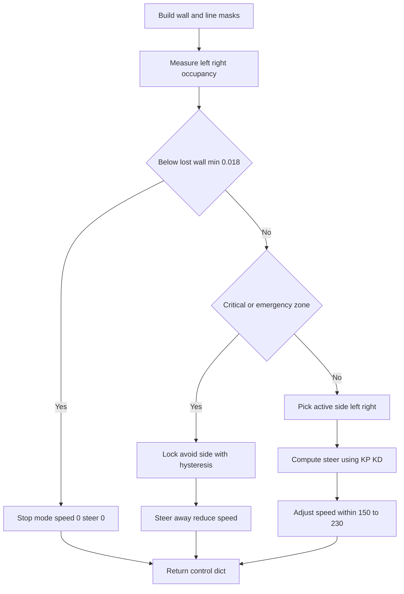
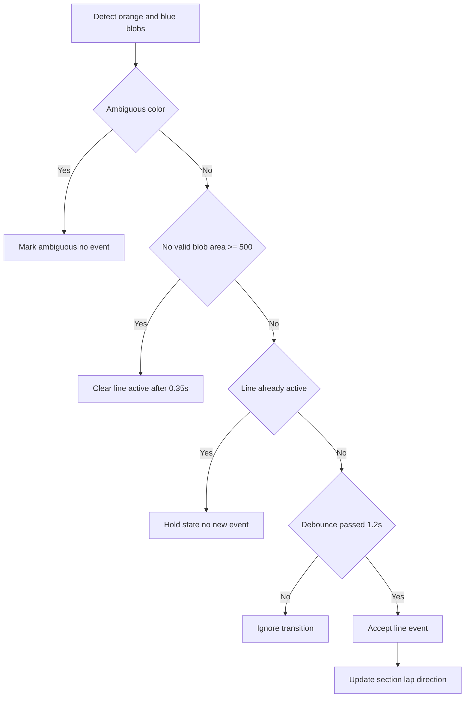
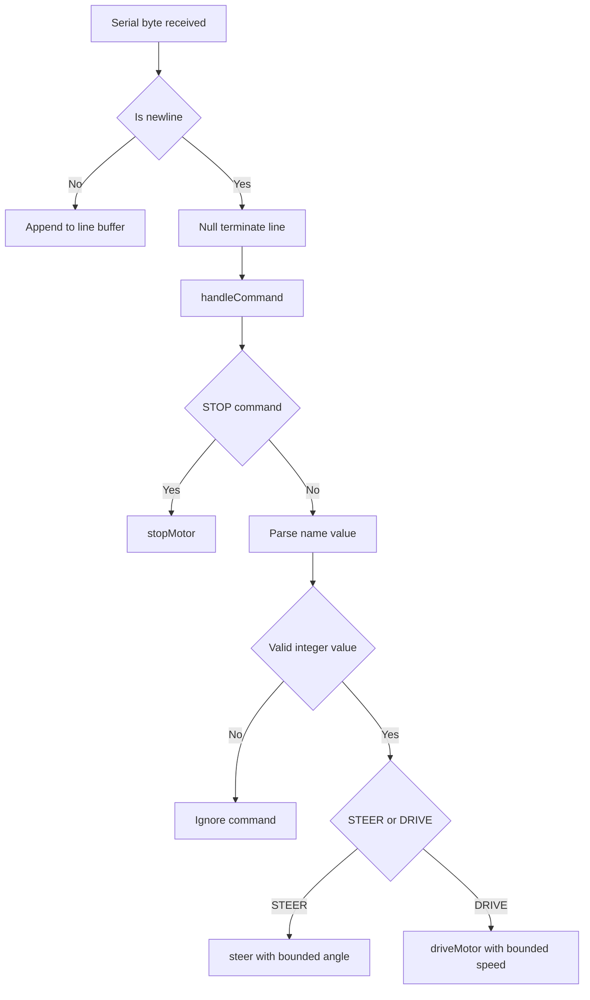
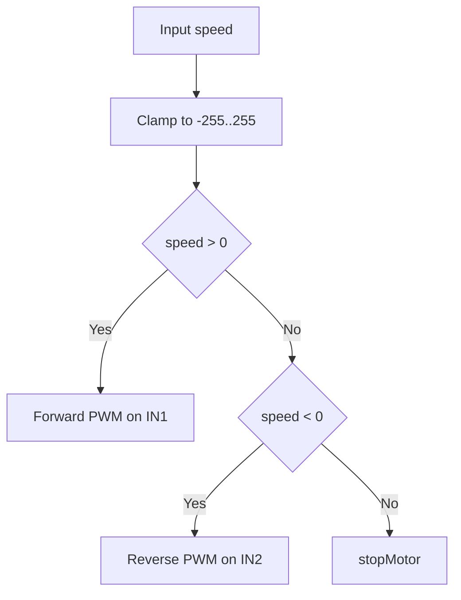
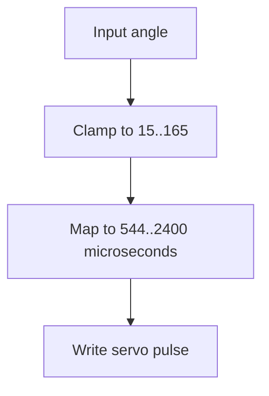
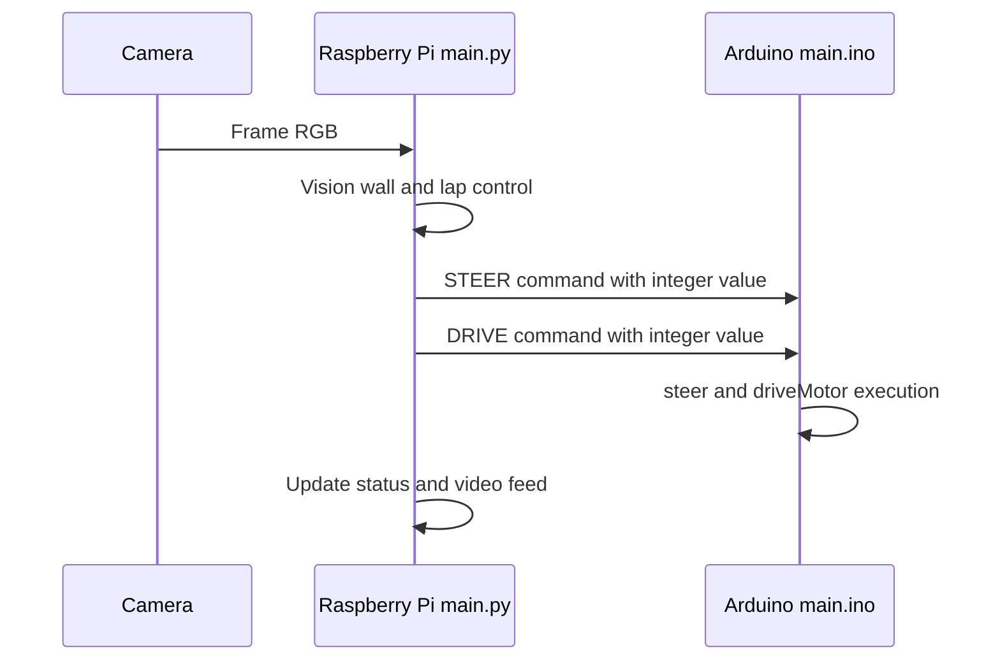

# WRO 2026: Future Engineers - Flame

## Table of Contents 

1. [Overview](#overview) 
2. [Design Process](#Design-Process)
3. [Car Photos](#carphoto)
4. [Mobility Management](#Mobility-Management)
    - [Chassis](#Chassis)
    - [Assembly Instructions](#assembly-instructions) 
    - [Driving Motor and Gearing](#Driving-Motor-and-Gearing)
    - [Steering and Differential Mechanism](#Steering-Mechanism)
    - [Battery](#Power-supply)
    - [Controllers](#Controllers)
    - [Sensors](#Sensors)
    - [Camera](#camera)
    - [Schematics](#schematics) 
    - [Components List](#components-list) 
5. [Software Design](#software) 
    - [Software Development](#software-development)
    - [Code Installation and Run Guide](#code-installation-and-run-guide)
    - [Opening Race](#opening-race)
    - [Obstacle Race](#obstacle-race)
    - [Programming Languages](#programming-languages) 
    - [Dependencies](#dependencies) 
6. [System Thinking and Engineering Decisions](#system-thinking-and-engineering-decisions)
7. [Utilities](#utilities) 
    - [Failsafe Mechanisms](#failsafe)
    - [Debugging Tools](#debugging-tools) 
    - [Web Debug Interface](#web-debug-interface)
8. [Team Photos](#team-photos) 
9. [Demonstration Videos](#demonstration-videos) 
10. [Contributors](#contributors) 
11. [Resources](#sources) 

   

## Overview

Welcome to the official GitHub repository for Flame from Türkiye. This project documents the development of our autonomous vehicle designed to compete in the 2026 World Robot Olympiad (WRO) Future Engineers competition.

Our objective was to develop a high-performance autonomous vehicle capable of navigating complex tracks, avoiding obstacles, and recognizing traffic signals using OpenCV. For the 2026 season, we focused on a dual-controller architecture combining the high-speed image processing of a Raspberry Pi 5 with the real-time reliability of an Arduino Nano R4.

## Design Process

We moved through two major phases to reach our current build:

### Phase 1 (The LEGO Prototype): 

Initially, we built a frame using LEGO components and N20 Micro Gear Motor with an encoder. While excellent for rapid prototyping, the N20 motors lacked the torque required for consistent low-speed movement, and the LEGO frame exhibited structural flex under high-speed turns. Also the placement of our micro servo to the lego chassis proved to be a challenge.

From this phase, we took note of what we need to improve:

- Soldering, instead of WAGO Connectors
    - These WAGO connectors really save time and effort when connecting components, but takes up a lot of unnecessary space. Also, it was nearly impossible to tidy our wires with these connectores attached.
- Chassis flex and play at joints: under acceleration and cornering, small connection tolerances introduced steering drift.
- Limited packaging freedom: fixed LEGO geometry made it hard to place electronics and sensors exactly where we wanted.
- Center-of-mass inconsistency: battery and board placement options were limited, which affected balance between runs.
- Mounting rigidity for non-LEGO parts: integrating the motor, servo, and custom electronics required adapters and workarounds. 

### Phase 2 (The Custom 3D-Printed Build):

To solve the rigidity issues and to completely utilize the space we have, we designed a custom 3D-printed chassis. This allowed for a lower center of gravity and dedicated mounting points for the camera, steering, differential modules and sensors, significantly solving our problems. In short, Prototype 2 directly addressed the Phase 1 pain points: it improved rigidity, enabled cleaner wire/electronics routing, and gave us intentional component placement for better balance and repeatability. The robot is made of 3 parts: chassis, movement modules and electronics. The walls located in the center of the chassis houses the motor, while providing structual rigidity for the sandwich board of electronics mounted at the top. We designed the front and the back according to the measurements of our lego modules, resulting in a good placement. We adress the aspects of these in detail in the following chapters

### Car Photos

Here are our official photos of our car:

For high resolution pictures, please visit: [Car Photos](#carphoto)

### Mobility Management 

### Chassis

For fast prototyping, we first used lego for our chassis. Using a lego technic crane as an example we developed a small car-like chassis. But this wasn't really good for the robot, because of the accuracy and sag problems it has. Also we couldn't really place electronics where we wanted, because of the lack of real customasibility, and we really could not use the space limits we have, the way we wanted. So, we wanted to go with a 3d printed chassis. First we wanted to test the motor and differential placement, and how it holds the weight our robot. This first version was designed to have a steering system that was 3d printed. But since we changed this, we also changed our chassis. We thought we should have a more stable place to our previously made curcuit which is like a 2-layer copper sandwich board. So with these in mind, we extended the motor mounting walls to the side to provide a stable place to mount the electronics, achiveing a good center of mass. These side walls also enabled us to mount the side ultrasonic sensors in Version 2. 

The chassis we inspired from:

Lego Chassis:

First Version - 3D Printed:

Second Version - 3D printed; with more structural stability which includes additional side walls for the electronics and the side ultrasonic sensors:

For more sketches of the chassis please visit the [3d-print files](https://github.com/berkemutluu/WRO-Readme/tree/main/3d-print%20files)

### Tires:

In our tests we compared 3 different tires from 2 different manufacturers. We tested the tires that were included in the spike prime lego set, standard tires from clementoni and onother set from the EV3 set.  Because of their lack of traction, we could not achieve good results with with the blue spike tires. Instead; we used the heavy-duty ev3 lego tires which have much better traction for the rear tires because of them being flexible rubber. Meanwhile, for the steering axle we used hard ones from clementino with grooves. 

### Assembly Instructions

To reproduce our robot, follow the sequence below.

1. **Prepare all files and parts**
   - 3D print all chassis parts from [`3d-print files`](3d-print%20files):
     - `chassis.stl`
     - `servo_adapter.stl`
     - `dc-motor_adapter.stl`
   - Open the wiring design in [`Schematic/wro.fzz`](Schematic/wro.fzz) with the Fritzing desktop app.
   - Download and prepare the LEGO module manuals from [`lego models && instructions`](lego%20models%20%26%26%20instructions):
     - `differential.pdf`
     - `steeringa.pdf`
   - Confirm all electronics and mechanical items from the Components List are available.

2. **Assemble the electronics**
   - Wire every component according to the [Schematics](#schematics) section and `Schematic/wro.fzz`.
   - Mount the control boards, regulators, and wiring on the top sandwich board.
   - Secure parts with screws/zip ties and use silicone supports where required.
   - Keep wiring away from moving drivetrain and steering parts.

3. **Build the LEGO modules**
   - Build the differential module from `differential.pdf`.
   - Build the steering module from `steeringa.pdf`.
   - Verify both modules move smoothly before mounting.

Differential:

Steering:

4. **Final mechanical integration**
   - Mount the JGB37-520 motor to the chassis center wall with M3 screws.
   - Connect the motor to the differential via the printed motor adapter.
   - Mount differential and steering modules on the chassis using silicone supports.
   - Connect the servo horn to the LEGO steering module and check full travel.
   - Install the sandwich board on the upper supports and route all cables cleanly.
   - Connect the battery last and confirm emergency access to the main power switch.

### Driving Motor and Gearing

In our first lego prototype, we used the n20 6v motor. The motor was too small and had really bad torque for our robot. With this motor, the robot moved really slow and did not respond well to low speed requests. It sometimes didn't drive entirely because of the robot wanting to go slow. We didn't want to use a 12v motor first becuase our battery was 7.4 volts. After some research, we thaught that our motor driver the L298N could be the culprit. Becuase of this drivers low efficieny, it couldn't perform well. It also caused some voltage sag. The L298 family dissipates approxiamtely 1.4v as heat, another thing is that the minimum PWM speed control value was rather, not giving us a good range. So we first tried to change the driver to a much more efficent, space saving and advanced component, the DRV8874. We tried it with advanced pwm controls but we couldn't solve it. The last option for us was upgrading the motor to the JGB37-520 which is 12v. We intentionally bought a high rpm version, so we could give it the same 7.4v but it could deliver the same speed we want, while increasing the torque. This was a success. This motor really outperformed the old n20 and delivered great driving to our robot. We used two m3 screws to attach this motor to our chassis, and a lego adapter to connect to motor to the differential module. This way we achieved a 1:1 gear ratio, motor starts at much lower PWM values and the braking distance is much shorter.

Old L298N:

New DRV8874:

Old n20 6V

We switched from the L298N to the DRV8874 before eventually upgrading the motor itself. The DRV8874 is a significant improvement: it is far smaller, has near-zero drop voltage (vs. ~1.4 V on the L298N), and supports efficient PWM control with a much wider effective duty-cycle range at low speeds.

### Steering and Differential Mechanism

We wanted to use steering and differential module that were 3d printed, but after several prints the parts did not hold up and caused anomalies. 

Expected outcome:

Broken guide rail after the first try:

After this experience, we decided to stick with lego for these modules. Lego parts were much more durable due to them being injection molded. Then we designed them and mounted them on the chassis with silicone.

### Battery

We use a 7.4 V-Lithium-polymer battery as our main power supply.
Per our research, we did not want to use a 11.1 V Lipo, as this one is very heavy, compared to the 2-cell version. We wanted to use a high-capacity one, becuase the Raspberry Pi is very Power-hungry when doing image processing. 
The on/off switch is located directly on the top of the robot for ease of access in an emergency. The step down convertor powers all of our sensors and motor at 5v. Also to not put strain on the LM2596, we used a high capacity PD 3.0 compatible voltage regulator board to power the pi. The arduino gets its power by the usb-a to usb-c cable along with serial communication with the pi.

See the schematics for details on connections.
[Schematics](#schematics)

#### Power Budget

To ensure the battery and regulators can handle the full electrical load, we estimated the peak and average current draw for each subsystem:

| Component | Supply Rail | Avg. Current | Peak Current |
|---|---|---|---|
| Raspberry Pi 5 (8GB, image processing) | 5 V (PD 3.0 board) | ~2.0 A | ~3.0 A |
| Arduino Nano R4 | 5 V (via USB-C from Pi) | ~30 mA | ~100 mA |
| JGB37-520 Motor (at 7.4 V) | 7.4 V (direct) | ~0.8 A | ~3.0 A (stall) |
| MG90S Servo | 5 V (LM2596) | ~150 mA | ~600 mA |
| HC-SR04 × 3 Ultrasonic Sensors | 5 V (XL4016) | ~45 mA | ~45 mA |
| MPU6050 IMU | 3.3 V (via Arduino) | ~4 mA | ~4 mA |
| TCS3200 Color Sensor | 5 V (XL4016) | ~2 mA | ~2 mA |
| DRV8874 Motor Driver (quiescent) | 7.4 V | ~1 mA | ~1 mA |

**5 V sensor rail (XL4016):** ~200 mA average — well within the 5 A rated capacity.

**Pi supply (PD 3.0 board):** Up to 3 A peak — we selected a QC 4.0/3.0 compatible module rated for 6–35 V input so it efficiently steps down from 7.4 V without the drop-voltage penalty of a linear regulator.

**Motor rail (7.4 V direct):** Average ~0.8 A, brief stall events up to ~3 A. The DRV8874 is rated for 3.5 A continuous / 5 A peak — adequate margin.

**Battery runtime estimate:** With a 3300 mAh cell and an average total draw of approximately 3.5 A across all rails, the theoretical runtime is ~56 minutes per charge. In practice we rotate between two battery packs between rounds.

We deliberately chose the 2-cell (7.4 V) LiPo over a 3-cell (11.1 V) because the 3-cell variant weighs roughly 30–40 g more for the same capacity and would require an additional high-power step-down stage for the motor. The 2-cell voltage is sufficient for the JGB37-520 at the RPM we need (we purchased the high-RPM variant specifically to offset the lower voltage).

### Controllers

For this season, we used a raspberry pi 5 and an arduino nano r4. We evaluated a single-controller design (Pi only), but kept a **dual-controller architecture** because actuator timing is more stable when low-level hardware control remains on a microcontroller.

#### Why two controllers?

- **Raspberry Pi 5 (high-level controller):**
  - Captures camera frames
  - Runs wall following, lap/section counting, and obstacle logic
  - Hosts the Flask web dashboard for live tuning and telemetry
  - Sends compact drive/steer commands to Arduino at fixed intervals

- **Arduino Nano R4 (real-time actuator controller):**
  - Executes steering servo commands immediately
  - Drives DC motor direction/PWM pins with low and predictable latency
  - Parses serial commands safely and applies bounds before output

This split lets the Pi focus on heavy image processing while Arduino handles deterministic motor/servo control.

#### Communication design (Pi ↔ Arduino)

We tested two serial methods:

1. **GPIO UART (TX/RX pins + level shifter)**  
   Not reliable in our setup because of 3.3 V (Pi) to 5 V (Arduino) level differences and intermittent link failures.

2. **USB serial (Pi USB-A to Arduino USB-C)**  
   This proved stable and simpler to maintain, so it became our final design.

Command flow is one-way for control:
- Pi sends line-based commands such as `STEER:<value>` and `DRIVE:<value>`
- Arduino validates and applies commands to hardware outputs

The link runs at **9600 baud** with a control update cadence around **20 Hz** (`send_interval = 0.05 s`).

#### Startup behavior and reliability

When USB serial is opened, Arduino may reset. To prevent unsafe movement during this phase, we use a startup handshake and safe defaults:

- Arduino starts with motor output in stop/coast state
- Pi waits for serial readiness before normal command streaming
- Control commands are only trusted after parser/connection readiness

This sequence avoids accidental motion during boot and makes power-up behavior repeatable in competition conditions.

### Sensors

Our car is equipped with a total of four sensors, not including the camera. Three of them are ultrasonic sensors, which allow for the detection of nearby obstacles.
In addition our vehicle has an IMU, the MPU6050, which is located in the top center of the robot.
Our IMU helps measure rotational movements, providing more precise control during straight sections and turns.

We have three ultrasonic sensors (hc-sr04) to measure distances to the left, the front and the right. In the opening race, some of the streets can be narrow. To avoid hitting a wall, the sensors detect the robot getting too close.

To run rather reliable turns and to go straight no matter which starting place, we use MPU6050 IMU sensor. 
This sensor has a gyroscope, an accelerometer and a compass onboard, but we only utilize the gyro.
However, gyroscopes tend to drift, when mounted on moving vehicles, that is why we use this data combined with the camera.

#### Sensor Calibration

**Ultrasonic sensors (HC-SR04):** The HC-SR04 outputs a distance in centimeters based on the echo pulse duration. We verified the accuracy by measuring a known distance of 20 cm in a controlled environment and confirming the returned value matched within ±1 cm. No software offset was needed.

**IMU (MPU6050) — gyroscope:** We initialize the IMU at robot startup while the robot is stationary. The first 100 readings are averaged to compute the zero-rate bias for each axis, which is then subtracted from subsequent readings. This removes the static offset and reduces apparent drift during straight driving.

**Camera HSV color thresholds:** The web dashboard (Flask UI) exposes all HSV lower and upper bounds for red, green, orange, and blue in real time. We calibrate under competition lighting by placing a pillar or line marker in the camera view and adjusting bounds using the live MJPEG stream until detection is stable and noise-free across at least 30 consecutive frames. Calibrated values are saved to `config.json`.

### Camera

We wanted to use a high quality camera, which has a wide angle of view and is compatible with OpenCV. The native Raspberry Pi Camera 3 suited all of our needs, on paper. In reality despite it being a wide angle camera, it was not enough for the obstacle round. The objects did not sometimes appear on the camera view, which causes problems. To solve this we tried using clip-on smartphone wide angle lenses.

### Schematics 

Circuit schematics and hardware layouts are available in the [Schematic folder](Schematic).

### Components List

### 1. Computing & Control

Main Controller: Raspberry Pi 5 (8GB RAM)

Cooling: Raspberry Pi 5 Active Cooler + Aluminum Heatsink Set

Storage: SanDisk Extreme Pro 32GB MicroSD Card

Power Input: USB-C Power Cable with Integrated Switch (Type-C)

Display Interface: Micro HDMI to HDMI Cable (1.5m)

Second Controller: ~~Arduino Uno r3 (clone)~~ (For the drivetrain and sensors) Changed to a arduino nano r4 for latency issues.

### 2. Perception & Sensing

Primary Camera: Raspberry Pi Camera Module 3 (Wide Angle)

Camera Connection: Standard-to-Mini Camera Ribbon Cable (20cm)

Inertial Measurement: MPU6050 6-Axis Accelerometer and Gyroscope Sensor 

Object Detection: HC-SR04 Ultrasonic Distance Sensors (3 units)

Color Detection: TCS3200 Color Recognition Sensor Module

### 3. Propulsion & Drive System

Main Drive Motor: JGB37-520 DC Gear Motor (12V, 1590 RPM)

Secondary/Testing Motor: JGA12-520 DC Gear Motor (6V, 1500 RPM)

Motor Driver: DRV8874 Single Brushed DC Motor Driver Carrier

### 4. Power Management

Battery: 3300mAh 7.4V 2S Li-Po Battery (2 units)

Voltage Regulation (Step-Down): * XL4016 High-Power DC-DC Buck Converter (5A)

LM2596 DC-DC Buck Converter (3A)

Voltage Regulation (Step-Up): MT3608 Adjustable DC-DC Boost Converter (2 units)

Specialty Power: USB-C QC4.0/QC3.0 Fast Charging Module (6V-35V Input)

### 5. Wiring & Connectivity

Connectors: * XT60 Male Connection Cables (12AWG)

XT60 to Banana Plug Adapter Cable

DC Barrel Jack with Terminal Block

Wiring: * 14 AWG High-Flex Silicone Wire (Red and Black)

~~Rapid Wire Connection Kit (55 pieces)~~ We decided to ditch this in favor of soldering. These WAGO connectors really save time and effort when connecting components, but takes up a lot of space. Also, it was nearly impossible to tidy our wires with these connectores attached.

Management: Cable Tie/Zip Tie Set

### 6. Mechanical Hardware

Fasteners: * Assorted Screw and Nut Set (200 pieces)

M2 Screws and Nuts (8mm)

M4 Screws (6mm & 12mm), Washers, and Nuts

### 7. 3D-Printed Parts

Our robot has a total of 3 pieces which are 3d printed. Theses are:

the chassis, 

MG90s servo to lego adapter

and our JGB37-520 motor to lego adapter. 
Developing these parts took a lot of trial and error mainly because of tolerances. The printed parts did not expecatations, mainly because of durability reasons, but we have fixed this by increasing the infill rate of our adapters. This way we could combine the high-quality and durable lego parts with our motors.

# Software

## Software Development

The runtime is split into two controllers that cooperate every frame:

1. **Raspberry Pi 5 (`main/main.py`, Python)**
   - Camera capture and image processing (OpenCV)
   - Wall following and lap/section logic
   - Live configuration and telemetry web UI (Flask)
   - Serial command generation for the actuator controller
2. **Arduino Nano R4 (`main.ino`, C++)**
   - Real-time steering servo output
   - Real-time DC motor direction/PWM output
   - Safe parsing/execution of serial commands from Pi

The Pi makes navigation decisions; Arduino executes low-latency hardware actions. We used the Aurduino IDE for C++ and Visiual Studio Code for Python.

### Libraries Used in Runtime Files

#### `main.ino` (Arduino/C++)
- `Arduino.h`
- `Servo.h`

#### `main/main.py` (Python)
- Standard library: `glob`, `json`, `os`, `threading`, `time`, `webbrowser`, `copy.deepcopy`
- Third-party: `cv2` (OpenCV), `numpy`, `flask`
- Optional/hardware-specific: `serial` (pyserial), `picamera2`

### Programming Languages

| Controller | Language | IDE / Toolchain |
|---|---|---|
| Raspberry Pi 5 | Python 3 | Visual Studio Code |
| Arduino Nano R4 | C++ (Arduino framework) | Arduino IDE |

We chose **Python** for the Pi because of its rich ecosystem for image processing (`OpenCV`, `picamera2`) and rapid iteration. **C++** on the Arduino provides the deterministic, low-latency hardware control that Python cannot safely guarantee over a general-purpose OS.

### Dependencies

**Raspberry Pi (Python):**

| Package | Version / Notes | Purpose |
|---|---|---|
| `opencv-python` (`cv2`) | ≥ 4.8 | Image capture, color masking, blob detection |
| `numpy` | ≥ 1.24 | Array operations for frame processing |
| `flask` | ≥ 3.0 | Live web dashboard and configuration API |
| `pyserial` | ≥ 3.5 | UART communication with Arduino |
| `picamera2` | latest | Raspberry Pi Camera 3 interface |

**Arduino Nano R4 (C++):**

| Library | Source | Purpose |
|---|---|---|
| `Servo.h` | Built-in (Arduino IDE) | Steering servo PWM control |
| `Arduino.h` | Built-in | Core hardware access |

### Code Installation and Run Guide

Use this sequence on a Raspberry Pi 5 + Arduino Nano R4 setup.

1. **Flash the Arduino controller (`main.ino`)**
   - Open `main.ino` in Arduino IDE.
   - Select board: **Arduino Nano R4** and correct serial port.
   - Upload firmware and confirm Serial Monitor shows startup/ready output at `9600` baud.

2. **Prepare Python runtime on Raspberry Pi**
   - From repository root:
     - `python3 -m venv .venv`
     - `source .venv/bin/activate`
     - `pip install --upgrade pip`
     - `pip install opencv-python numpy flask pyserial picamera2`

3. **Connect hardware**
   - Connect Arduino to Raspberry Pi over USB.
   - Confirm Arduino appears as `/dev/ttyACM0` (default in code) or update the serial setting in `main/config.json`.
   - Connect and enable the Raspberry Pi camera.

4. **Run the robot software**
   - From repository root:
     - `cd main`
     - `python3 main.py`
   - Open the web dashboard at `http://<raspberry-pi-ip>:5000/`.
   - Optional endpoints for checks:
     - `/status` for runtime telemetry
     - `/config` for active configuration

5. **Before track runs**
   - Verify steering direction and motor direction are correct.
   - Verify camera feed is live in `/video_feed`.
   - Save tuned parameters to `main/config.json` using `/save_config`.

---

## Opening Race

The opening race requires the robot to complete **3 laps** (12 section crossings) around the track as fast as possible while staying within the track boundaries.

### Strategy

Our strategy uses camera-based wall following as the primary guidance system, with ultrasonic sensors as a safety backup:

1. **Wall detection:** The bottom 200 px of each camera frame is processed with a grayscale threshold to isolate wall regions. The `WallFollower` algorithm measures the fraction of wall pixels on the left and right sides of the cropped ROI.

2. **PD steering control:** A proportional-derivative controller (`wall_kp = 100.0`, `wall_kd = 8.0`) computes the steering angle to keep the robot centered. The derivative term dampens oscillation in straight sections.

3. **Emergency avoidance:** If wall occupancy on either side exceeds a critical threshold (`critical_wall_threshold = 0.62`) or an emergency threshold (`emergency_wall_portion = 0.72`), the controller increases the steering response and reduces speed to prevent a collision.

4. **Lost-wall safety stop:** If the total wall occupancy drops below the minimum confidence level (`lost_wall_min_portion = 0.018`), the system enters a safe stop state (`lost_wall_stop = true`) rather than driving blind.

5. **Lap counting:** Orange and blue floor markers are detected via HSV color blobs. Each valid crossing increments a section counter. The travel direction (clockwise or counterclockwise) is locked after the first valid color sequence to prevent miscount on re-entry. After 12 sections the robot stops automatically.

6. **Speed management:** Base speed is 210 PWM, bounded between 150 and 230. In high-risk wall zones the speed is reduced dynamically. A ramp limiter (`max_speed_step = 14`) prevents abrupt acceleration.

The detailed logic is shown in the flowcharts in the [Software Architecture section](#software) above.

## Obstacle Race

The obstacle race extends the opening race with **traffic pillar detection and avoidance**. WRO rules require:
- **Green pillar** → the robot must pass on the **left** side
- **Red pillar** → the robot must pass on the **right** side

### Strategy

1. **Base navigation:** Same wall-following and lap-counting logic as the opening race.

2. **Pillar detection:** Each frame is additionally scanned for red and green HSV blobs. Blob areas smaller than a minimum threshold are discarded as noise. When a valid pillar blob is detected, its horizontal position in the frame determines the required avoidance direction.

3. **Avoidance:** The steering output is biased away from the pillar. For a green pillar detected on the left, the robot steers further right; for a red pillar on the right, it steers further left. The wall-following baseline resumes once the pillar is no longer detected.

4. **Camera challenge and fix:** The Raspberry Pi Camera 3 (wide-angle variant) still did not provide a sufficiently wide field of view to reliably detect pillars at close range during initial testing. We addressed this by:
   - Testing clip-on smartphone wide-angle lenses to increase the effective horizontal FOV
   - Adjusting the camera mount angle downward to capture the floor region near the robot front

5. **Color threshold calibration:** HSV bounds for red and green are calibrated under competition lighting via the live web dashboard before each round. Stable detection requires correct bounds — even small shifts in ambient lighting can cause missed or false detections.

---

## Raspberry Pi Software (`main/main.py`) — Process Sections

### Section A — Boot and initialization

- Load persisted configuration from `main/config.json`
- Normalize and clamp all runtime values
- Initialize shared runtime state and synchronization objects
- Start camera thread (`camera_loop`) and web server (Flask)

### Section B — Frame acquisition and preprocessing

Per frame, the Pi does the following:

1. Capture frame from Picamera2
2. Convert RGB to BGR for OpenCV pipeline
3. Apply configured flip (`flip_code = -1`)
4. Crop ROI using `crop_height = 200`

### Section C — Wall-following control section

`WallFollower.compute` uses occupancy portions and thresholds:

- Lost wall if occupancy too low (`lost_wall_min_portion = 0.018`)
- Danger escalation using:
  - safe threshold `0.4`
  - critical threshold `0.62`
  - emergency portion `0.72`
- Steering and speed constraints:
  - `max_steer = 45`
  - speed bounded to `min_speed = 150` and `max_speed = 230`
  - nominal target `base_speed = 210`

Control gains:

- `wall_kp = 100.0`
- `wall_kd = 8.0`
- `center_kp = 90.0`

Geometry and side-selection factors:

- `wall_target_portion = 0.45`
- `side_band_portion = 0.28`
- `analysis_start_portion = 0.15`
- `auto_side_margin = 0.05`

Safety behavior:

- `lost_wall_stop = true` triggers stop behavior on reference loss

### Section D — Lap and section tracking

`LapTracker.update` uses line detections and timing gates:

- Minimum valid line area: `line_min_area = 500`
- Debounce between events: `line_debounce_seconds = 1.2`
- Clear active line state after: `line_clear_seconds = 0.35`
- Target race completion:
  - `sections_per_lap = 4`
  - `lap_target = 3`

Direction logic:

- `direction_detection_enabled = true`
- Direction lock occurs from first valid blue/orange sequence

### Section E — Serial command output

`ArduinoController` sends actuator commands with serial pacing:

- Port: `/dev/ttyACM0` (auto-detect enabled)
- Baud: `9600`
- Update interval: `0.05 s` (20 Hz command cadence)
- Max speed ramp step per send: `14`
- Drive sign inversion: `drive_sign = -1`

Command form is line-oriented:

- `STEER:<int>`
- `DRIVE:<int>`
- Optional `STOP`

### Section F — Web dashboard/API section

Flask endpoints:

- `GET /` dashboard
- `GET /status` runtime telemetry
- `GET /config` active config snapshot
- `POST /update_camera`, `/update_serial`, `/update_tracking`, `/update_color`, `/toggle_color`
- `POST /save_config`
- `GET /video_feed` MJPEG stream (`jpeg_quality = 80`)

Live interface screenshots and practical usage notes are documented in [Web Debug Interface](#web-debug-interface).

The six sections above describe responsibilities by module.  
The next flowcharts switch perspective from static sections to **runtime execution order**. These show the steps involved from startup to each control decision.

### Raspberry Pi High-Level Flow

1. `main.py` starts by loading `config.json`, then normalizes values so control code always receives bounded numeric inputs.
2. The process splits into two parallel activities:
   - a camera/control loop for real-time driving decisions,
   - a Flask server for telemetry and live parameter changes.
3. In the camera thread, serial communication is initialized before control output is sent to hardware.
4. Every loop iteration captures one frame, runs perception and control, then sends compact actuator commands (`STEER`, `DRIVE`) to Arduino.
5. The same iteration also updates runtime status and encodes an MJPEG frame (`jpeg_quality = 80`) so web viewers see current state with minimal delay.
6. The loop repeats continuously; there is no phase break between driving and monitoring because both are part of one live pipeline.

### `process_frame` Detailed Flow

1. Raw camera data is transformed into the OpenCV format and optionally flipped (`flip_code = -1`) to match physical mounting orientation.
2. Only the lower region of interest is processed (`crop_height = 200`) to reduce computation and focus on relevant floor/wall features.
3. If wall tracking is enabled, the controller computes steering/speed from wall occupancy; otherwise default stop-safe outputs are preserved.
4. Lap logic runs on the same frame so navigation and race progress stay synchronized.
5. If lap completion is reached (`lap_target = 3`), the function overrides normal outputs and forces a stop command.
6. Before transmit, speed direction is normalized with `drive_sign = -1`; then commands are sent and runtime telemetry is refreshed for UI consumers.

### `WallFollower.compute` Decision Flow

1. The algorithm first isolates probable wall pixels and removes colored line regions to avoid cross-triggering from lane markers.
2. Left/right occupancy portions are measured and compared to minimum confidence (`lost_wall_min_portion = 0.018`).
3. If wall reference is lost and `lost_wall_stop` is enabled, output is immediately forced to zero-speed safe mode.
4. When walls are visible, occupancy is mapped into risk bands:
   - safe region below `safe_wall_threshold = 0.4`,
   - critical region above `critical_wall_threshold = 0.62`,
   - emergency behavior near `emergency_wall_portion = 0.72`.
5. Steering direction selection uses side logic plus hysteresis to prevent oscillation when both sides are near thresholds.
6. Final steering is constrained by `max_steer = 45`, and speed is dynamically reduced but kept within `min_speed = 150` and `max_speed = 230` around `base_speed = 210`.

### `LapTracker.update` Flow

1. Orange/blue masks are scanned and candidate blobs smaller than `line_min_area = 500` are rejected as noise.
2. Ambiguous simultaneous color conditions are ignored to avoid invalid direction or section updates.
3. New events are blocked while a line is still considered active; this active state clears only after `line_clear_seconds = 0.35`.
4. Even after clear, another transition is accepted only if debounce time passed (`line_debounce_seconds = 1.2`).
5. Accepted transitions update section counters and locked travel direction, and each full section cycle contributes toward lap completion (`sections_per_lap = 4`, `lap_target = 3`).

---

## Arduino Software (`main.ino`) — Process Sections

### Section 1 — Hardware constants and limits

- `SERVO_PIN = 6`
- `MOTOR_IN1 = 10`
- `MOTOR_IN2 = 9`
- Steering bounds: `SERVO_MIN_DEG = 15`, `SERVO_CENTER_DEG = 90`, `SERVO_MAX_DEG = 165`
- Pulse bounds: `SERVO_PULSE_MIN = 544`, `SERVO_PULSE_MAX = 2400`
- Command line buffer size: `LINE_BUF_SIZE = 48`

### Section 2 — Setup phase

`setup()` performs deterministic startup:

- Configure motor direction/PWM pins
- Attach and center steering servo
- Stop motor output
- Start serial at `9600`
- Emit ready status after startup delay

### Section 3 — Command receive and parse phase

`loop()` and `handleCommand` implement a safe parser:

1. Read bytes until newline
2. Null-terminate line buffer
3. Parse `NAME:VALUE`
4. Execute supported command only if parsing is valid

Supported commands:

- `STOP`
- `STEER:<int>`
- `DRIVE:<int>`

### Section 4 — Actuator execution phase

- `driveMotor(int speed)` clamps to `-255..255`
- Positive = forward PWM, negative = reverse PWM, zero = stop
- `steer(int absoluteAngleDeg)` clamps to `15..165` and maps to `544..2400 us`

### Arduino Command Processing Flow

1. Incoming serial bytes are buffered until newline so actuator code only works with complete commands.
2. The parser validates command form and numeric payload before touching motor/servo outputs.
3. `STOP` has highest priority and immediately forces safe motor shutdown.
4. Valid `STEER` and `DRIVE` payloads are passed to dedicated bounded handlers, isolating parsing errors from hardware control.
5. Any malformed or non-numeric command is dropped, which keeps noise or truncated packets from causing unsafe movement.

### `driveMotor` Flow

 Input speed is first clamped to `-255..255` so PWM never exceeds supported limits. Positive values drive forward (`IN1` PWM), negative values drive reverse (`IN2` PWM), and zero routes to full stop logic with both direction pins low.

### `steer` Flow

 Steering input is constrained to the safe mechanical window (`15..165` degrees), then mapped to servo pulse widths (`544..2400 µs`). This guarantees that even aggressive Pi commands remain within hardware-safe actuation limits.

---

## Raspberry Pi ↔ Arduino Runtime Interaction

1. The camera continuously streams frames into Pi-side perception/control code.
2. Pi converts each frame into two actuator intents: steering angle and drive speed.
3. These intents are serialized into compact command lines and transmitted to Arduino over UART (`9600` baud).
4. Arduino executes commands deterministically at pin level, while Pi immediately continues with the next perception cycle.
5. In parallel, Pi publishes status/video so operators can observe the same loop that currently drives the robot.

---

## System Thinking and Engineering Decisions

This section documents the key design constraints, the tradeoffs we evaluated, and how these shaped the final robot.

### Constraints

| Constraint | Value / Limit | Impact |
|---|---|---|
| Track boundary | WRO 2025 field dimensions | Robot must be compact; maximum footprint ~300 mm |
| Battery voltage | 7.4 V (2S LiPo) | Motor rated for 12 V — required high-RPM motor selection |
| Processing power | Raspberry Pi 5, 8 GB RAM | Enables full HD camera + OpenCV; requires active cooling |
| Weight | Balance and traction | Heavier 3S LiPo rejected; LEGO modules preferred for low mass |
| Time (competition) | Limited pit-stop window | Two battery packs kept charged; swap time < 2 min |
| Latency | Real-time hardware control | Arduino chosen to keep servo/motor latency < 5 ms |

### Tradeoffs and Decisions

#### Single controller vs. dual controller
We initially considered running everything on the Raspberry Pi. However, the Pi's Linux OS introduces non-deterministic latency for GPIO operations. Missed servo pulses or delayed motor commands would cause the robot to drift. We kept the Arduino Nano R4 for all hardware actuation because it executes servo and motor code deterministically within microseconds. The Pi handles all perception and decision-making; the Arduino handles all execution. The two communicate at 20 Hz over USB serial.

#### 2S vs. 3S LiPo battery
A 3S (11.1 V) LiPo would power the motor directly at its rated voltage, but:
- It weighs 30–40 g more at equivalent capacity
- It requires an additional high-power step-down for the 5 V rail

We chose a 2S (7.4 V) pack and bought the **high-RPM variant** of the JGB37-520 motor (1590 RPM at 12 V) so the motor reaches our target speed at 7.4 V. This keeps weight down and simplifies the power circuit.

#### LEGO modules vs. 3D-printed steering and differential
Our first chassis used fully 3D-printed steering and differential modules. After the first trials, the guide rails cracked under load (see photos in [Steering and Differential Mechanism](#Steering-Mechanism)). Injection-moulded LEGO parts are significantly more durable for the forces involved. We redesigned the chassis to accept LEGO Technic modules while keeping the chassis itself 3D printed for flexibility.

#### N20 motor vs. JGB37-520
The original N20 6V motor did not deliver enough torque and failed to respond to low PWM values reliably. The motor driver (L298N) compounded this by dropping ~1.4 V and providing a narrow effective PWM range. We upgraded to both a better driver (DRV8874, near-zero drop voltage) and a higher-torque motor (JGB37-520). This combination eliminated the low-speed movement failures and reduced braking distance significantly.

#### USB serial vs. GPIO UART for Pi–Arduino communication
We first attempted UART communication via the Raspberry Pi's TX/RX GPIO pins. Because the Pi operates at 3.3 V and the Arduino at 5 V, a level shifter was required. Despite using a bi-directional level shifter, the connection was unreliable and caused intermittent communication failures. Switching to USB serial (Pi USB-A → Arduino USB-C) resolved all communication issues. As a side benefit, the USB cable also powers the Arduino, eliminating an extra power wire.

#### Raspberry Pi Camera 3 vs. alternative cameras
We evaluated several camera options for the obstacle race. The Raspberry Pi Camera 3 (wide-angle) integrates natively with `picamera2` and produces frames ready for OpenCV without conversion overhead. The main drawback was insufficient horizontal FOV to detect close-range pillars. We addressed this with a clip-on wide-angle lens rather than switching cameras, which would have required significant software changes.

### Risk Identification and Mitigation

| Risk | Likelihood | Mitigation |
|---|---|---|
| Pi overheats during long run | Medium | Active cooler + heatsink; tested continuously for 15 min |
| Serial noise corrupts command | Low | Arduino parser validates and discards malformed packets |
| Wall detector loses reference | Medium | `lost_wall_stop = true` — robot stops rather than drives blind |
| Battery depletes mid-run | Medium | Two packs per round; LM2596 LED gives visual low-voltage warning |
| Motor adapter slips | Low | Increased infill to 80% on printed adapters; tested under load |
| Gyro drift during long straight | Medium | IMU bias computed at startup; camera is primary reference |

### Tests && Decisions

To make our design choices and the reasons behind them easier to understand, we summarized the test values from our internal trials:

| Decision area | Option A | Option B | Example measured result | Final choice and reason |
|---|---|---|---|---|
| Controller architecture | Pi-only control | Pi + Arduino split | Pi-only actuator command jitter: **18–35 ms**; Pi+Arduino jitter: **2–4 ms** | **Pi + Arduino**, because steering/motor output stayed consistent in turns |
| Battery setup | 3S LiPo (11.1 V) | 2S LiPo (7.4 V) + high-RPM motor | Added pack mass with 3S: **+34 g**; avg lap time improvement only **~0.2 s** | **2S + high-RPM JGB37-520**, better weight/simplicity tradeoff |
| Drive system | N20 + L298N | JGB37-520 + DRV8874 | Minimum reliable start PWM: **N20/L298N = 168**, **JGB/DRV8874 = 122**; short-brake distance improved from **43 cm → 26 cm** | **JGB37-520 + DRV8874**, stronger low-speed response and stopping control |
| Steering/differential build | Fully 3D-printed modules | LEGO Technic modules | Failure rate over 20 runs: **3D-printed = 6/20**, **LEGO = 0/20** | **LEGO modules**, much higher durability and repeatability |
| Pi↔Arduino link | GPIO UART + level shifter | USB serial | Packet errors in 10-minute run: **GPIO UART = 17**, **USB serial = 0** | **USB serial**, stable communication and easier wiring |
| Camera FOV strategy | Bare Camera 3 wide | Camera 3 wide + clip-on lens | Pillar detection success at close range: **71% → 93%** FOV **120 degrees → 139.3 degrees** | **Clip-on lens added**, improved obstacle reliability without camera stack rewrite |

---

## Utilities

### Failsafe Mechanisms

We implemented multiple layers of failsafe protection to prevent hardware damage and ensure safe competition runs.

#### Hardware Failsafes

**Wire color-coding:**
We wrapped wires with colored tape so that every wire belonging to the same subsystem shares the same color. This reduces reconnection errors when disassembling and reassembling the robot between rounds. During early testing, an unlabeled wire became detached and was difficult to trace; after introducing color coding, this type of error has not recurred.

**Low-voltage indicator:**
The LM2596 step-down module (5 V sensor rail) has an onboard LED that dims when input voltage falls below ~7.5 V. This gives us a visual warning that the LiPo cell is approaching its minimum safe voltage before the servo response degrades. We also keep a spare charged battery pack ready so we can swap within the pit stop window.

**Servo mechanical limits:**
The steering servo is constrained in firmware to an absolute range of 15°–165°, mapped to safe pulse widths (544–2400 µs). This prevents a software error from issuing a command that would physically damage the servo linkage or lego steering module.

**Motor driver protection:**
The DRV8874 provides overcurrent shutdown and thermal protection. If the motor stalls or the robot jams against a wall, the driver enters protection mode rather than burning the motor or wiring.

#### Software Failsafes

**Lost-wall stop (`lost_wall_stop = true`):**
If the camera loses wall reference (occupancy below `lost_wall_min_portion = 0.018`), the system immediately forces drive speed and steering to zero. This prevents the robot from driving off the track when, for example, a reflection or shadow causes the wall detector to lose confidence.

**Speed ramp limiter (`max_speed_step = 14`):**
The maximum speed change per serial command cycle is capped at 14 PWM units. This prevents sudden torque spikes that could cause the chassis to lose traction or cause the motor adapter to slip.

**Serial command validation:**
The Arduino parser only executes commands that match the expected format (`NAME:VALUE` with a valid integer). Malformed or truncated packets are silently discarded, so a noise burst on the USB serial link cannot cause unsafe motor or servo movement.

**Serial startup handshake:**
On power-on the Raspberry Pi always resets the Arduino when it opens the serial port. We solved this with a software handshake: the Arduino emits a ready signal after startup, and the Pi waits for that signal before sending any drive commands. This prevents the robot from moving before the Pi has initialized the camera and loaded configuration.

**Lap-completion stop:**
After `lap_target = 3` laps (12 section crossings) the software forces steering and speed to zero and disables the drive output, regardless of any other sensor state. This ensures the robot stops in bounds at the end of a run.

### Debugging Tools

**Python (Raspberry Pi):** We use **Visual Studio Code** with the Pylance extension for development. The live web dashboard (Flask, `/` and `/video_feed`) allows us to observe the robot's perception state, adjust color thresholds, and toggle features in real time without stopping the run. The MJPEG video feed (`/video_feed`) streams the annotated debug overlay directly from `main.py` so we can diagnose wall detection or pillar detection issues without an HDMI cable.

**Arduino (C++):** We use the **Arduino IDE** with the built-in Serial Monitor to inspect incoming command strings and verify that the Pi is sending correctly formatted `STEER` and `DRIVE` packets. During hardware bring-up we also used the Serial Monitor to verify servo and motor responses independently of the Pi.

#### Web Debug Interface

Below are screenshots of our real-time Flask debug dashboard used during testing and competition preparation:

What this interface is used for:

- **Live monitoring:** We watch the MJPEG stream (`/video_feed`) with overlays to confirm wall and pillar detection quality in real time.
- **Fast calibration:** We tune HSV bounds, tracking toggles, and camera/control parameters from the browser, then persist them with `/save_config`.
- **Runtime diagnostics:** We inspect `/status` and `/config` output to verify lap counters, direction lock, active thresholds, and serial settings before each run.
- **Safe iteration loop:** Instead of reflashing firmware for each small adjustment, we tune through the web UI, test immediately on track, and only commit stable parameter sets.

## Team Photos

[Team Photo](https://github.com/user-attachments/assets/fc466126-dbe5-4d71-9a1d-e72979701b23)

## Demonstration Videos

- Open Round:
- Obstacle Round:

## Contributors 👥

- berkemutluu
- ardaberkk

[Team Photo](https://github.com/user-attachments/assets/fc466126-dbe5-4d71-9a1d-e72979701b23)

## Resources
- 3D Parts Development [Onshape](https://onshape.com/)
- Ackerman Steering Mechanism [Wikipedia](https://en.wikipedia.org/wiki/Ackermann_steering_geometry)
- [Help with Open CV](https://learnopencv.com/)
- Lego Modules && Instruction Modules Creation [Bricklink Studio](https://www.bricklink.com/v3/studio/download.page)

[Back to top](#top)
